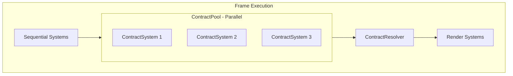

# Contract System for Parallel ECS Execution

## Goal

Enable parallel execution of ECS systems by deferring mutations. Systems emit **contracts** (intent to mutate) instead of mutating directly. A resolver processes all contracts at end-of-frame in deterministic order.

---

## Architecture



**Key insight:** Systems opt-in by inheriting `ContractSystem<>`. Converted systems run in parallel. Non-converted systems continue to work unchanged.

---

## Thread Safety Analysis

### EntityHelper During Parallel Execution

The afterhours library uses a two-list pattern for entity creation:

```cpp
// entity_collection.h
Entities entities_DO_NOT_USE;   // Main list - systems iterate this
Entities temp_entities;          // Staging area for new entities

Entity &createEntity() {
    temp_entities.push_back(...);  // Goes to temp, NOT main list
    return *temp_entities.back();
}
```

After each sequential system, `merge_entity_arrays()` moves temp → main.

**During ContractPool parallel execution:**

| Operation | Thread Safe? | Notes |
|-----------|--------------|-------|
| `get_entities()` | ✅ Yes | Returns const ref to stable list |
| `getEntityForID(id)` | ✅ Yes | Read-only iteration |
| `entity.get<T>()` | ✅ Yes | Component access, no list modification |
| `createEntity()` | ✅ Yes | Goes to thread-local temp_entities |
| `merge_entity_arrays()` | ❌ NO | Modifies main list - must not call |
| `cleanup()` | ❌ NO | Modifies main list - must not call |
| `entity.cleanup = true` | ✅ Yes | Just sets a flag, cleanup happens later |

**Rule:** ContractSystems must NOT call `merge_entity_arrays()` or `cleanup()`. These are called by the pool AFTER all parallel work completes.

### Execution Guard

Add an atomic flag to catch violations:

```cpp
// src/system/contract_pool.h
inline std::atomic<bool> g_contract_pool_executing{false};

struct ContractPool {
    void execute(const Entities& entities, float dt) {
        g_contract_pool_executing = true;
        
        // ... dispatch to thread pool, wait for futures ...
        
        g_contract_pool_executing = false;
        
        // NOW safe to merge temp entities
        EntityHelper::merge_entity_arrays();
    }
};
```

Add debug asserts (can be in pharmasea wrapper or afterhours):

```cpp
static void merge_entity_arrays() {
    assert(!g_contract_pool_executing && 
           "merge_entity_arrays called during parallel pool execution");
    get_default_collection().merge_entity_arrays();
}
```

### What ContractSystems Can Safely Do

| Action | Safe? | Contract Alternative |
|--------|-------|---------------------|
| Read components | ✅ | - |
| Query entities | ✅ | - |
| Modify components | ❌ | Emit mutation contract |
| Create entities | ⚠️ | Emit SpawnEntity contract (goes to temp, but won't be visible until merge) |
| Delete entities | ❌ | Emit DeleteEntity contract |
| Call other systems | ❌ | Not supported |

---

## System Analysis Summary

Analysis generated by `scripts/analyze_systems.py`.

| Category | Count | Risk | Action |
|----------|-------|------|--------|
| **Read-only systems** | 54 | Zero | Convert first - just gain parallelism |
| **Writer systems** | 18 | Low | Need mutation contracts |
| **Total** | 72 | | |

### Writer Systems (18) - Need Contracts

| System | Writes To | Priority |
|--------|-----------|----------|
| ProcessGrabberItemsSystem | CanHoldItem | High |
| ProcessConveyerItemsSystem | CanHoldItem, Transform | High |
| ProcessSpawnerSystem | *EntityCreation* | High |
| ProcessHasRopeSystem | *EntityCreation*, IsItem | Medium |
| UpdateHeldItemPositionSystem | Transform | Medium |
| ProcessPnumaticPipeMovementSystem | IsPnumaticPipe | Medium |
| UpgradeInRoundUpdateSystem | *EntityCreation* | Medium |
| DeleteFloatingItemsWhenLeavingInRoundSystem | *EntityDeletion* | Low |
| DeleteTrashWhenLeavingPlanningSystem | *EntityDeletion* | Low |
| DeleteCustomersWhenLeavingInroundSystem | *EntityDeletion* | Low |
| ProcessTrashSystem | *EntityDeletion* | Low |
| TellCustomersToLeaveSystem | CanPathfind | Low |
| UpdateNewMaxCustomersSystem | IsRoundSettingsManager | Low |
| AICommitNextStateSystem | HasAIBathroomState | Low |
| ResetCustomersThatNeedResettingSystem | IsRoundSettingsManager | Low |
| UpdateVisualsForSettingsChangerSystem | HasName | Low |
| ProcessIsContainerAndShouldUpdateItemSystem | *EntityDeletion* | Low |
| ProcessIsIndexedContainerHoldingIncorrectItemSystem | *EntityDeletion* | Low |

### Dependency Chain: CanHoldItem

The most important chain to understand:

```
ProcessGrabberItemsSystem  ──writes──> CanHoldItem
ProcessConveyerItemsSystem ──writes──> CanHoldItem, Transform
ProcessGrabberFilterSystem ──reads───> CanHoldItem (read-only, safe)
UpdateHeldItemPositionSystem ─writes─> Transform
```

Convert Grabber and Conveyer together. Their contracts resolve in registration order.

---

## New Files

### 1. `src/engine/thread_pool.h`

```cpp
#pragma once
#include <thread>
#include <queue>
#include <mutex>
#include <condition_variable>
#include <future>
#include <functional>

struct ThreadPool {
    std::vector<std::thread> workers;
    std::queue<std::function<void()>> tasks;
    std::mutex queue_mutex;
    std::condition_variable condition;
    bool stop = false;
    
    explicit ThreadPool(size_t num_threads = std::thread::hardware_concurrency()) {
        for (size_t i = 0; i < num_threads; ++i) {
            workers.emplace_back([this] {
                while (true) {
                    std::function<void()> task;
                    {
                        std::unique_lock lock(queue_mutex);
                        condition.wait(lock, [this] { return stop || !tasks.empty(); });
                        if (stop && tasks.empty()) return;
                        task = std::move(tasks.front());
                        tasks.pop();
                    }
                    task();
                }
            });
        }
    }
    
    template<typename F>
    auto submit(F&& f) -> std::future<decltype(f())> {
        using R = decltype(f());
        auto task = std::make_shared<std::packaged_task<R()>>(std::forward<F>(f));
        std::future<R> result = task->get_future();
        {
            std::unique_lock lock(queue_mutex);
            tasks.emplace([task]() { (*task)(); });
        }
        condition.notify_one();
        return result;
    }
    
    ~ThreadPool() {
        { std::unique_lock lock(queue_mutex); stop = true; }
        condition.notify_all();
        for (auto& w : workers) w.join();
    }
};
```

### 2. `src/system/contract_base.h`

```cpp
#pragma once
#include <memory>
#include <vector>
#include <atomic>

enum class Urgency : uint8_t {
    Now,            // Never defer (0 frames)
    EndOfFrame,     // This frame (0 frames)
    NextSecond,     // Up to 120 frames
    BeforeRound,    // Up to 120 frames
    Eventually,     // Up to 600 frames
};

struct ContractBase {
    size_t system_order = 0;
    size_t emission_order = 0;
    Urgency urgency = Urgency::EndOfFrame;
    uint16_t frames_deferred = 0;
    
    virtual void resolve() const = 0;
    virtual ~ContractBase() = default;
    
    uint16_t max_deferral() const {
        switch (urgency) {
            case Urgency::Now:         return 0;
            case Urgency::EndOfFrame:  return 0;
            case Urgency::NextSecond:  return 120;
            case Urgency::BeforeRound: return 120;
            case Urgency::Eventually:  return 600;
        }
        return 0;
    }
    
    bool must_process_now() const {
        return urgency <= Urgency::EndOfFrame || frames_deferred >= max_deferral();
    }
};

template<typename MutationType>
struct ContractWrapper : ContractBase {
    MutationType data;
    ContractWrapper(MutationType d) : data(std::move(d)) {}
    void resolve() const override { data.resolve(); }
};

// Global queue - filled by ContractPool, drained by Resolver
inline std::vector<std::unique_ptr<ContractBase>> g_contract_queue;

// Execution guard - true while ContractPool is running parallel systems
inline std::atomic<bool> g_contract_pool_executing{false};

// Global mutations (entity lifecycle)
namespace GlobalMutation {
    struct SpawnEntity {
        int entity_type;
        float x, y, z;
        std::function<void(Entity&)> configure;
        void resolve() const;
    };
    
    struct DeleteEntity {
        int entity_id;
        void resolve() const;
    };
}
```

### 3. `src/system/contract_system.h`

```cpp
#pragma once
#include "../ah.h"
#include "contract_base.h"

// Base class for systems in the parallel pool
struct ContractSystemBase {
    size_t system_registration_id = 0;
    mutable std::vector<std::unique_ptr<ContractBase>> pending_contracts;
    
    virtual bool should_run(float dt) const = 0;
    virtual void once(float dt) const {}
    virtual void run(const afterhours::Entities& entities, float dt) const = 0;
    virtual void after(float dt) const {}
    virtual ~ContractSystemBase() = default;
    
    std::vector<std::unique_ptr<ContractBase>> harvest_contracts() {
        return std::move(pending_contracts);
    }
};

template<typename... Components>
struct ContractSystem : ContractSystemBase, afterhours::System<Components...> {
    using Base = afterhours::System<Components...>;
    
    // Emit a contract - const-correct, thread-safe per-system
    template<typename MutationType>
    void emit(MutationType mutation, Urgency urgency = Urgency::EndOfFrame) const {
        auto contract = std::make_unique<ContractWrapper<MutationType>>(std::move(mutation));
        contract->system_order = system_registration_id;
        contract->emission_order = pending_contracts.size();
        contract->urgency = urgency;
        pending_contracts.push_back(std::move(contract));
    }
    
    bool should_run(float dt) const override { return Base::should_run(dt); }
    
    void run(const afterhours::Entities& entities, float dt) const override {
        for (const auto& entity : entities) {
            if (!entity) continue;
            Base::for_each(*entity, dt);  // const version
        }
    }
    
    // Override in derived: receives const entity
    virtual void for_each_with(const Entity&, const Components&..., float) const {}
};
```

### 4. `src/system/contract_pool.h`

```cpp
#pragma once
#include "contract_system.h"
#include "../engine/thread_pool.h"
#include <cassert>

struct ContractPool {
    std::vector<std::unique_ptr<ContractSystemBase>> systems_;
    ThreadPool pool_;
    
    template<typename T, typename... Args>
    void register_system(Args&&... args) {
        auto sys = std::make_unique<T>(std::forward<Args>(args)...);
        sys->system_registration_id = systems_.size();
        systems_.push_back(std::move(sys));
    }
    
    void execute(const afterhours::Entities& entities, float dt) {
        if (systems_.empty()) return;
        
        // Set guard - asserts will fire if merge/cleanup called during execution
        g_contract_pool_executing = true;
        
        std::vector<std::future<std::vector<std::unique_ptr<ContractBase>>>> futures;
        futures.reserve(systems_.size());
        
        for (auto& sys : systems_) {
            futures.push_back(pool_.submit([&sys, &entities, dt]() {
                if (!sys->should_run(dt)) return std::vector<std::unique_ptr<ContractBase>>{};
                sys->once(dt);
                sys->run(entities, dt);
                sys->after(dt);
                return sys->harvest_contracts();
            }));
        }
        
        // Wait for all systems and collect contracts
        for (auto& f : futures) {
            auto contracts = f.get();
            for (auto& c : contracts) {
                g_contract_queue.push_back(std::move(c));
            }
        }
        
        // Clear guard - now safe to merge/cleanup
        g_contract_pool_executing = false;
        
        // Merge any entities created during parallel execution
        afterhours::EntityHelper::merge_entity_arrays();
    }
};
```

### 5. `src/system/contract_resolver.h`

```cpp
#pragma once
#include "../ah.h"
#include "contract_base.h"
#include <algorithm>
#include <chrono>

struct ContractResolverSystem : afterhours::System<> {
    static constexpr float FRAME_BUDGET_MS = 2.0f;
    
    bool should_run(float) override { return !g_contract_queue.empty(); }
    
    void once(float) override {
        // Sort: urgency, then age (starvation prevention), then registration order
        std::stable_sort(g_contract_queue.begin(), g_contract_queue.end(),
            [](const auto& a, const auto& b) {
                if (a->urgency != b->urgency)
                    return static_cast<int>(a->urgency) < static_cast<int>(b->urgency);
                if (a->frames_deferred != b->frames_deferred)
                    return a->frames_deferred > b->frames_deferred;
                if (a->system_order != b->system_order)
                    return a->system_order < b->system_order;
                return a->emission_order < b->emission_order;
            });
        
        auto start = std::chrono::high_resolution_clock::now();
        auto it = g_contract_queue.begin();
        
        while (it != g_contract_queue.end()) {
            auto& contract = *it;
            
            if (contract->must_process_now()) {
                contract->resolve();
                it = g_contract_queue.erase(it);
                continue;
            }
            
            auto now = std::chrono::high_resolution_clock::now();
            float elapsed = std::chrono::duration<float, std::milli>(now - start).count();
            
            if (elapsed < FRAME_BUDGET_MS) {
                contract->resolve();
                it = g_contract_queue.erase(it);
            } else {
                contract->frames_deferred++;
                ++it;
            }
        }
    }
};
```

---

## Component Mutations

Components declare their allowed mutations (like `serialize()`):

### `src/components/can_hold_item.h` - Add:

```cpp
struct CanHoldItem : public BaseComponent {
    // ... existing fields ...
    
    struct Mutation {
        struct TransferTo {
            int item_id;
            int from_holder;
            int to_holder;
            
            void resolve() const {
                auto from = EntityHelper::getEntityForID(from_holder);
                auto to = EntityHelper::getEntityForID(to_holder);
                auto item = EntityHelper::getEntityForID(item_id);
                if (!from || !to || !item) return;
                
                from->get<CanHoldItem>().held_item_id = -1;
                to->get<CanHoldItem>().held_item_id = item_id;
                item->get<IsItem>().set_held_by(to->get<CanHoldItem>().held_by, to_holder);
            }
        };
        
        struct Clear {
            int holder_id;
            void resolve() const {
                auto h = EntityHelper::getEntityForID(holder_id);
                if (h) h->get<CanHoldItem>().held_item_id = -1;
            }
        };
    };
};
```

---

## Migration Plan

### Phase 1: Infrastructure (1-2 hours)

Create the 5 new files listed above. No behavior changes yet.

Files: `thread_pool.h`, `contract_base.h`, `contract_system.h`, `contract_pool.h`, `contract_resolver.h`

### Phase 2: Integration (30 min)

Modify `src/system/system_manager.h`:

```cpp
struct SystemManager {
    // ... existing ...
    ContractPool contract_pool;  // Add this
};
```

Modify `src/system/afterhours_systems.cpp`:

```cpp
void SystemManager::register_afterhours_systems() {
    register_sixtyfps_systems();
    register_gamelike_systems();
    register_modeltest_systems();
    register_inround_systems();
    register_planning_systems();
    
    // NEW: Run contract pool and resolver before render
    systems.register_update_system([this](float dt) {
        contract_pool.execute(oldAll, dt);
    });
    systems.register_update_system(std::make_unique<ContractResolverSystem>());
    
    register_render_systems();
}
```

### Phase 3: First Conversion - Read-Only (1 hour)

Convert 4 simple read-only systems to validate the infrastructure:

1. `ClearAllFloorMarkersSystem`
2. `ResetHighlightedSystem`  
3. `HighlightFacingFurnitureSystem`
4. `CountTriggerAreaEntrantsSystem`

Changes per system:
- Change `: public afterhours::System<...>` to `: public ContractSystem<...>`
- Change `for_each_with(Entity&, ...)` to `for_each_with(const Entity&, ...) const`
- Move from `systems.register_update_system()` to `contract_pool.register_system<T>()`

**Expected result:** Systems run in parallel, behavior unchanged.

### Phase 4: First Writer - ProcessGrabberItemsSystem (1 hour)

1. Add `Mutation` structs to `CanHoldItem` (see above)
2. Convert `ProcessGrabberItemsSystem` to `ContractSystem<>`
3. Replace `chi.update(item, id)` with `emit(CanHoldItem::Mutation::TransferTo{...})`
4. Test item grabbing works correctly

### Phase 5: Incremental Migration

Convert remaining systems based on priority:

| Priority | Systems | Reason |
|----------|---------|--------|
| High | ProcessConveyerItemsSystem | Shares CanHoldItem with Grabber |
| High | ProcessSpawnerSystem | Entity creation |
| Medium | UpdateHeldItemPositionSystem | Transform writes |
| Low | Deletion systems | Safe to defer |

---

## Urgency Reference

| Urgency | Max Defer | Use Case |
|---------|-----------|----------|
| `Now` | 0 | Entity needed this frame |
| `EndOfFrame` | 0 | Item transfers, state changes |
| `NextSecond` | 120 | Visual updates |
| `BeforeRound` | 120 | Store generation |
| `Eventually` | 600 | Cosmetic (vomit) |

---

## Caveats

1. **Stale reads**: ContractSystems see start-of-pool state, not other systems' mutations
2. **Entity creation timing**: Use `Urgency::Now` if entity is queried same frame
3. **Dependency chains**: Convert related systems together (Grabber + Conveyer)

---

## Future Optimizations

- **Template bloat**: If compile times become an issue, consider type-erasing contracts with `std::function` or a variant approach
- **Tracy integration**: Add profiler zones per system and resolver for performance analysis
- **Contract history**: Keep last N resolved contracts for debugging

---

## Files Summary

| File | Type | Purpose |
|------|------|---------|
| `src/engine/thread_pool.h` | New | Parallel execution |
| `src/system/contract_base.h` | New | ContractBase, Urgency, g_contract_queue |
| `src/system/contract_system.h` | New | ContractSystem<> base class |
| `src/system/contract_pool.h` | New | Parallel pool executor |
| `src/system/contract_resolver.h` | New | End-of-frame resolver |
| `src/system/system_manager.h` | Modify | Add ContractPool member |
| `src/system/afterhours_systems.cpp` | Modify | Register pool + resolver |
| `src/components/can_hold_item.h` | Modify | Add Mutation structs |
| `scripts/analyze_systems.py` | New | Dependency analysis tool |

