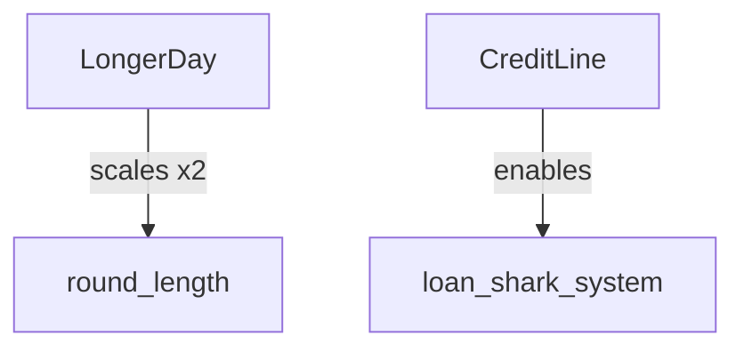

# Pub Panic — Master Plan (Architecture + Upcoming Features + Source Docs)

This is the **single master document** consolidating:

- The **blue‑sky “perfect” architecture** (breaking changes allowed)
- How that architecture supports **upcoming features** referenced in planning docs
- A **verbatim appendix** of the planning docs themselves

---

## 1) Canonical blue‑sky architecture (breaking changes OK)

### Goals

- Reduce gameplay concepts to a small set of reusable primitives.
- Make behavior live in **systems** (not `entity_makers.cpp` lambdas).
- Make interaction/holding/work **one consistent pipeline**.
- Make new content creation **data-driven** (archetypes), not “edit 6 switches”.

### Current-state pain points (grounded in `src/entity_makers.cpp` + `src/system/*`)

- **Interaction/holding is fragmented**
  - multiple “carry slots” (`CanHoldItem`, `CanHoldFurniture`, `CanHoldHandTruck`)
  - multiple “held flags” (`CanBeHeld`, `CanBeHeld_HT`)
  - held-by semantics also exist in `IsItem`
  - multiple systems update held transforms, and input owns collision exceptions
- **Machine logic is duplicated**
  - draft tap “beer add” exists in two places today (two sources of truth)
  - a mix of “work lambdas” and ad-hoc systems implement machines
- **Trigger areas and containers are split across micro-systems** with repeated queries and repeated gating.
- **Factories are doing too much** (renderer selection + behavior wiring + giant type switch).

### The perfect minimal component model

#### Core
- `Transform`
- `Tags` (category flags)

#### Physics
- `Collider` (shape + layer/mask)
- `KinematicBody` (velocity / desired motion)

#### Interaction + carrying (the biggest simplifier)
- `Interactor` (reach + focus + intent)
- `Interactable` (allowed interactions + requirements)
- `Inventory` (slots, e.g. hand/tool/carry)
- `Attachment` (child → parent + socket/offset rule)

This replaces the entire “holding ecosystem”:
- `CanHoldItem`, `CanHoldFurniture`, `CanHoldHandTruck`
- `CanBeHeld`, `CanBeHeld_HT`
- “held-by” state in `IsItem`
- multiple held-position systems and input-level special casing

#### Work
- `Workable` (progress + action id + UI flags)

No callbacks stored in components.

#### Machines / crafting
- `Machine` (type id + input/output rules + timing)
- `DrinkState` (ingredients + metadata)
- `IngredientSource` (tool/bottle that adds ingredients; uses remaining; validation id)

#### AI
- `Agent` (single customer state machine: state, targets, timers, memory)

#### Economy / store / progression
- `Wallet`
- `Priced`
- `StoreItem`
- `WorldTime` (singleton-like)
- `RoundRules` (singleton-like)

### The perfect system architecture (one pipeline per domain)

#### World / state
- `WorldTimeSystem` (advance time, emit transition events)
- `RoundSystem` (upgrades/unlocks/spawning rules)

#### Input + interaction (one consistent pipeline)
- `InputSystem` → writes intent into `Interactor`
- `FocusSystem` → picks best `Interactable` per interactor
- `InteractSystem` → grab/place/use/work with consistent validation
- `AttachmentSystem` → updates transforms for attachments

#### Movement / physics
- `MovementSystem` (intent → velocity)
- `CollisionSystem` (resolve using collider masks)
- `NavSystem` (path requests + follow-path for AI)

#### Machines / crafting
- `MachineSystem` (machine execution, insertion/extraction rules)
- `CraftingSystem` (apply ingredient additions, consume uses, update `DrinkState`, emit sound/FX events)

#### AI
- `CustomerAISystem` (single state machine: queue → drink → pay → leave + side-quests)
- `QueueSystem` (shared line mechanics)

#### UI
- `UIHintSystem` (progress bars/speech bubbles/icons derived from state)
- `RenderPrepSystem` (resolve model variants)
- `RenderSystem` / `UISystem`

### Perfect entity creation: archetypes, not switches

Replace `convert_to_type()` and most of `entity_makers.cpp` with archetypes:

- `Archetype { components + defaults + tags }`
- optional constructor hook id for rare procedural setup

### “If we only do one thing”

Build **Interaction + Inventory + Attachment** first. It collapses the biggest complexity cluster and makes machines + AI refactors dramatically simpler.

---

## 2) What this architecture needs to support “coming soon” features

This section is derived from: `todo.md`, `ideas.md`, `progression_tree.md`, and `docs/game_brief.md`.

### A) Upgrades/modifiers with time windows (Happy Hour, themed nights, dynamic pricing)

Add a first-class **Rule/Modifier** model:

- `RuleId` + activation conditions (`TimeWindow`, `DayCount`, `InStore`, etc.)
- effects as data (config multipliers/deltas, enabling systems, injecting store/spawn pools)
- `WorldTime` provides phase + percent to evaluate time-window rules

### B) Automation progression + jams + hazards + auto-clean

Make logistics a domain, not ad-hoc behavior:

- `Machine(type_id)` specializations for belts/inserters/pipes/dispensers
- `TransportState` / `ItemFlow` for in-transit state
- `JamSystem` that emits `Spill`/`Hazard` entities when throughput fails
- cleanup is just `Workable(action_id="clean_spill")`; mop buddy is just an `Agent`

### C) Customer traits + variants (thieves, loud/rude, speedwalkers, chatty)

- `Traits` / `StatusEffects` component with `TraitId` entries (+ params)
- AI remains one `Agent` state machine, with thief branches and crime events consumed by detectors/security

### D) Groups + multi-orders + bulk serving (pitchers, flights, “birthday shots”)

- structured `Order` data (line items + counts + constraints)
- `DrinkState` supports multi-serve containers (pitcher servings remaining; flight multiple contents)

### E) VIP / zones / priority routing (red carpet, priority register, “try this” board)

- `Zone` entities (rect/polygon) with `ZoneEffects`
- `FocusSystem`/`InteractSystem` consult zone rules
- `CustomerAISystem` consults zone rules for register selection and order generation

### F) Alternate ordering modes (tablet/kiosk/mobile preorder/pickup later)

- `OrderQueueSystem` is first-class, not “register owns the line”
- `OrderSource` + `Fulfillment` modeled explicitly
- customer AI gains “wait elsewhere / pickup later” states

### G) Minigames as upgrades (DDR/rhythm mixing, diagetic trigger)

- `MinigameStation` entity with `MinigameId`, cooldown (“once per round”), reward events
- rewards implemented as temporary `RuleId` activations / modifiers

### H) Economy extensions (rent, utility billing, debt recovery / loan shark)

- `EconomySystem` supports scheduled charges (rent/utilities) and debt state
- “transactions” are events consumed by UI (not bespoke animation logic)

### I) Map generation/playability constraints

- map validation is first-class (pre-spawn validators on the ASCII seam)
- deterministic retry + reason codes
- archetypes spawned from the validated seam (no gameplay-time patching)

---

## 3) Appendix — Source docs (verbatim)

### `todo.md`

````markdown
---

kanban-plugin: basic

---

## backlog

- [ ] WARN: need a way to warn that UI elements are offscreen "purpling"
- [ ] Add "powered by raylib" intro card (and other intro cards) like cat v roomba: https://github.com/raysan5/raylib-games/tree/master/cat_vs_roomba/src
- [ ] Create Doors
- [ ] Add a pause menu with textual options
- [ ] Add system for exporting resources to code for easier binary packaging ([see branch packager](https://web.archive.org/web/20210923054249/https://veridisquot.net/singlefilegames.html))
- [ ] Create Nav mesh for "walkability"
- [ ] Add some way for entities to subscribe to certain keys so we can more easily keep track of what keys are being requested over lifetime
- [ ] Fix corner walls
- [ ] Upgrade Astar to ThetaStar (worth doing?)
- [ ] support for tile sheets
- [ ] Consider using https://github.com/raysan5/rres for resources
- [ ] Particle system?
- [ ] Spritesheet animator
- [ ] consider switching to https://github.com/graphitemaster/0xABAD1DEA for all of our static globals
- [ ] Look into if its worth using fmod for sound: https://www.fmod.com/
- [ ] Investigate Fiber jobs: http://gdcvault.com/play/1022186/Parallelizing-the-Naughty-Dog-Engine
- [ ] Create / Use a flatmap/flatset for better cache locality on smaller data sets
- [ ] Should we be using arena allocators?


## infra changes

- [ ] collision for player to change to cylinder
- [ ] pressing two movement at the same time while moving camera sometimes feels weird
- [ ] In pause menu, remap key bindings in layer for arrows keys to choose options
- [ ] rendering oreder for text background is weird
- [ ] likely dont need to queue network packets since we always send the full state

- [ ] AttachmentSystem (+ Attachment/Attachable): unify held item/furniture/handtruck/rope via generic parent→child attachment with local offsets/orientation/collidability; removes duplicated update math and special-cases; reduces desyncs.
- [ ] Progress/Cooldown components + ProgressRender: centralize timers/progress bars (work, patience, fishing, triggers) and a single HUD/bar renderer; fewer bespoke render paths and less UI drift.
- [ ] TriggerAreaSystem: own entrants counting, validation, progress/cooldown and activation; removes scattered trigger logic and TODOs in systems; clearer round/lobby/store flows.
- [ ] GameState change hooks (StateManager on_change): register once to handle player moves, store open/close, resets; eliminates manual cross-calls sprinkled across systems; safer transitions.
- [ ] Entity Tags/Groups (+ TaggedQuery): bitset tags like Store, Permanent, CleanupOnRoundEnd; simplifies queries and bulk operations; replaces ad‑hoc include_store_entities and type checks.
- [ ] EntityRegistry (id → shared_ptr): O(1) lookup for ids; removes linear scans in helper; safer hand-offs for systems needing shared ownership.
- [ ] CollisionCategory/CollisionFilter components: data-driven collision layers and exceptions (e.g., attached items, MopBuddy/holder, rope); replaces hardcoded branches in is_collidable; easier to reason about.
- [ ] PrefabLibrary (data-driven entity builders): move repetitive makers to JSON prefabs (like drinks/recipes already); shrinks large makers file; reduces human error and speeds iteration.
- [ ] BillboardText/WorldLabel component + system: single way to draw floating names/prices/speech bubbles/progress labels; consistent styling/sizing and fewer one-offs.
- [ ] Ability + Cooldown pattern: normalize “do work” interactions (squirter, indexer, adds_ingredient) using Progress/Cooldown; reduces bespoke timers/flags and makes balance easier.
- [ ] LifecycleSystem (deletion/cleanup policies): tag-driven bulk delete/persist on state changes; removes bespoke cleanup loops and TODOs about tagging.
- [ ] EventBus (GameEvents): small pub/sub around existing event pattern for AttachmentChanged, TriggerActivated, UpgradeUnlocked, StateChanged; decouples systems and reduces globals traffic.
- [ ] TransformFollower sockets (named anchors): define front/right/top sockets for precise child placement while following; deletes face-direction math scattered across updates.
- [ ] InputContext system: drive KeyMap by context (Menu/Game/Paused) instead of hardcoding; clarifies input paths and fixes edge-cases when menus overlap gameplay.

// merged from afterhours planning
- [ ] vendor/afterhours: switch all includes to the local wrapper `src/ah.h` (ensures `ENABLE_AFTERHOURS_BITSERY_SERIALIZE` and bitsery includes). Update: `src/layers/gamelayer.h`, `src/job.h`, `src/components/base_component.h`, `src/entity.h`.
- [ ] vendor/afterhours: stop including internal headers like `afterhours/src/base_component.h`; include only the public `afterhours/ah.h` via our wrapper.
- [ ] vendor/afterhours: centralize serialization on vendor implementations. Enable `ENABLE_AFTERHOURS_BITSERY_SERIALIZE` via build flags and remove local serializers for `afterhours::Entity` and `afterhours::BaseComponent` in `src/entity.h` and `src/components/base_component.h`. Verify network roundtrips.
- [ ] vendor/afterhours: standardize on `afterhours::Entities`/`afterhours::RefEntity` aliases; remove duplicate `using` aliases in `src/entity_helper.h` and elsewhere.
- [ ] vendor/afterhours: evaluate migrating `EntityHelper` functionality (create/get/delete, range/collision queries, cleanup) to vendor equivalents to reduce duplication; replace linear scans with registry/lookup if provided.
- [ ] vendor/afterhours: compare our `EntityQuery` to vendor query APIs; if equivalent (whereHasComponent/whereInRange/orderByDist), migrate usage to vendor to shrink maintenance.
- [ ] vendor/afterhours: review job/task facilities; decide whether to adapt `src/job.h` to vendor API or keep custom; document decision.
- [ ] vendor/afterhours: check for vendor component-registration utilities for polymorphic serialization; replace manual `MyPolymorphicClasses` maintenance if available.
- [ ] vendor/afterhours: ensure submodule is initialized and pinned (`.gitmodules`); build uses `-Ivendor/` include path. Add CI guard to fail if submodule missing. Resolve nested submodules (e.g., `vendor/cereal`) by adding URLs or vendoring headers to avoid update failures.

## code health (readability, stability, and build hygiene)

- [ ] Create a precompiled header (pch.hpp) for heavyweight third-party headers (raylib/rlgl/raymath, fmt, nlohmann/json, bitsery, magic_enum, argh) to reduce compile times
- [ ] Split src/engine/graphics.h into graphics_types.h (types + declarations, no raylib includes) and graphics.cpp (definitions); move operator<< implementations out of the header
- [ ] In src/engine/model_library.h, forward declare `namespace raylib { struct Model; }` and move raylib includes and model conversion logic into a new model_library.cpp
- [ ] Introduce a lightweight network/fwd.h or network/api.h used by src/game.cpp instead of including heavy network/network.h; refactor call sites accordingly
- [ ] Run Include-What-You-Use (IWYU) across src/; add a scripts/run_iwyu.sh that consumes compile_commands.json and fix reported over-includes
- [ ] Reduce transitive includes in public headers: include only what you use, prefer forward declarations for Files, Library, Singleton where only refs/pointers are needed
- [ ] Avoid including <raymath.h> and <rlgl.h> from headers; include them only in .cpp files that need them
- [ ] Isolate template-heavy headers (bitsery, serialization) to dedicated headers included only by .cpp that need them; avoid pulling them into broadly included headers
- [ ] Add -ftime-trace to a build target to profile compile hotspots and track before/after improvements; check in a short report
- [ ] Enable sanitizers in Debug builds: ASan + UBSan by default; TSan for network tests
- [ ] Add clang-tidy with bugprone-*, clang-analyzer-*, cppcoreguidelines-*, readability-*, performance-*; wire it into CI and a local script
- [ ] Turn warnings into errors in CI and raise warning level: -Wall -Wextra -Wshadow -Wconversion -Wsign-conversion -Wold-style-cast -Wimplicit-fallthrough
- [ ] Strengthen types: replace naked int/float parameters with enum class and strong typedefs (EntityId, PlayerId); use std::chrono for durations
- [ ] Prefer std::unique_ptr/std::shared_ptr for ownership; use gsl::not_null for non-owning pointers
- [ ] Add RAII wrappers for raylib resources (Model/Texture/Sound) with proper unload in destructors to prevent leaks and double-frees
- [ ] Use tl::expected (vendor expected.hpp) for fallible operations (file IO, network parsing) instead of bool/error out-params
- [ ] Apply [[nodiscard]] and noexcept where appropriate for public APIs to catch ignored results and enable better codegen
- [ ] Add unit tests for serialization/deserialization (e.g., ModelInfo) and basic network message round-trips; add fuzz tests for malformed inputs
- [ ] Add guard helpers for index/bounds checks and precondition asserts; replace undefined behavior with explicit errors
- [ ] Add a crash handler with backward-cpp to capture symbolized stack traces in Debug builds
- [ ] Document include policy and code style; add a pre-commit hook to run format, clang-tidy (local-only), and basic static checks
- [ ] Audit and minimize global/singleton usage; make access thread-safe or pass explicit context; wrap network:: globals with atomics or accessors


## no repro

- [ ] cosmopolitan model is invisible
- [ ] PS4 Controller touchpad causing “mouse camera rotation”<br>clicking the touchpad & analog stick in the opposite direction cam rotates that way


## design decisions

- [ ] Simple Syrup doesnt dissapear after one use and its kinda the only one that does that…
- [ ] penalty if you make too much extra? waste too much ingredients
- [ ] Text doesnt rotate based on the camera
- [ ] Not clear you can cycle through alcohols
- [ ] guys keep coming back to register. eventually need to add money system or something
- [ ] Should alcohol have to be put back? should it be like the soda / simple syrup
- [ ] add practice mode to learn recipe
- [ ] why should you clean up the bar? do people not want to come in? <br><br>cant serve until its clean?
- [ ] Should the roomba only spawn by default for single player games? Should it spawn at the beginning ever?
- [ ] warn player when they are deleting something that we need
- [ ] need to add some ui to saw how many or when more people will spawn as its not clear
- [ ] should customers be able to look like players?
- [ ] add an are you sure? when switching resolution and languages
- [ ] settings dropdown doesnt respect selected language
- [ ] - more likely to vomit if they waited longer for their drink ?
- [ ] should the day be longer based on number of customers
- [ ] - waiting reason overlaps with customer count at 1600x900 but not 1080p<br><br>- fixed but need to look into how the sizing works cause it should be proportional
- [ ] - should alcohols be multi-use and then you throw out the empty bottle
- [ ] - patience for first round should be double or triple?
- [ ] - not enough customers to need automation?


## broke

- [ ] mojito model is big square
- [ ] mai tai has no model
- [ ] having pathfinding crashes when rendering the waiting queue (disabled it for now )
- [ ] lime doesnt want to go into drink when cup is in register
- [ ] lime wont go in unless i add lime juice first?
- [ ] toilet hitbox is messed up
- [ ] - vomit hitbox is hard especially without mop

## complete

**Complete**
- [x] joining twice from a remote computer crashes the host
- [x] drop preview box sometimes has the wrong color
- [x - bug where you cant place the table next to the register<br>- => (i’ve disable bounds checking on placement for now)
- [x] Cant repro but i got the FF box to show trash icon inside. putting it back in the trash and taking out fixed it
- [x] remove job system and switch to just tons of components HasPath, CanWaitInQueue, CanIdle, CanMop, etc
- [x] add reroll to shop
- [x] need preview for where item will go
- [x] Tell the player how many customers are coming this round
- [x] hard to tell that a new machine/stockpile has been spawned in after you get an upgrade
- [x] at round 3 the people got stuck in line as if there was an invis person at the front
- [x] highlight spots on the map where this thing can go
- [x] day 3 doesnt work, i think it skips unlock screen and that breaks it
- [x] During planning its hard to know what each machine it, not obvious
- [x] default language is reverse which is confusing
- [x] vomit is broken not working
- [x] Add purchasing medicine cab
- [x] Roomba keeps getting stuck at exit
- [x] BUG: Hide pause buttons from non-host since they dont really do anything anyway
- [x] Client player cant change settings because menu::State is being overriden by host
- [x] - you can fill up the cup while its in the cupboard
- [x] We probably need some way in Progression screen to know what the new drink's recipe is like
- [x] if you take the drink back from the customer you crash
- [x] Automatically teleport new players when joining InRound / Planning etc
- [x] controls dont work for gamepad in settings during game

%% kanban:settings
```
{"kanban-plugin":"basic"}
```
%%
````

### `ideas.md`

````markdown
# Pub Panic! - Idea Inventory
- (is this too close to plate up?) 
- AI players need items they want ("Orders")
- Small / Medium / Large bottle
- How do upgrades work?
    - Options: Deterministic Skill Tree or RNG + money(Like Plateup)
- Draughts station
    - Auto-fill upgrade? 
- POS System
    - Automatically takes payment (Square ipad) 
- Generic stocking
    - Canned beers and sodas
    - Able to load up a whole shelf at a time
    - Grab box from pallet and drop on shelf to refil 
    - Each pallet holds 10 refills
    - How to get a new pallet
- Cash Register
    - multiple lines per register
    - People at register dont lose patience
        - Or maybe lose patience when not floating still and regenerate a little bit on snapping
- Conveyer belts or tractor beam
- Cleaning bar after use, otherwise risk losing order spot 
- Rerolls have chance for really rare things (sloth in SAPs)
- Difficulty modifiers 
    - SpeedWalkers: Customers walk 1.5x as fast
    - Social Drinkers: Customers always order multiple drinks
    - Self Medicated: Customers order spirits only 
    - Chatty Drinkers: Customers spend twice as long to explain their order
    - Bad Insurance Rates: make half as much money 
    - Curious customers: Customers ask questions while paying 
        - Decrease patience of other customers in the same line (implicitly)
    - Chatty Customers: Customers take twice as long to pay
        - Need some jokes
    - Mummblers: Customer orders are harder to read 
    - Bad Fins: You walk slow? Get tired more easily? Have to rest? 
- Different game modes
    - 
- Customers have attributes?
    - Loud customers (giant speech bubble) 
    - Rude customers () 
    - Drunk customers ()
- Allow players to exchange held items?

## About

Pub Panic! is a simulation game where players manage a high-energy urban bar. As the bartender, players must keep their customers satisfied by serving drinks quickly and efficiently. Success is measured by maximum throughput and meeting the weekly financial targets (The Rent).
best out of the group i think: 
Mixology Mayhem
Tipsy Tavern
"Pub Panic"
Pub Party Panic
Pub Pandemonium
"Sips & Shenanigans"
"Cheers & Chaos"
Whimsy Tavern
Tipsy Troubles
Spirited Shenanigans
Cocktail Capers

Some I like the vibe of but im not 100%: 
Tipsy Teamwork
Boozy Blitz
Cocktail Carousel
Cocktail Conundrum
Cocktail Commotion
Pour Perfect
Mixer Madness
Topsy-Turvy Tavern
Tipsy Toasters
Fizzy Fiasco

Ones I dont like at all: 
Cocktail Circus
Mix Masters Mayhem
Fizzing Frenzy
Boozy Bartender Bonanza
Sip & Serve Soiree
Whimsical Whiskey Bar
Bartender's Bliss
Mixologist Madness
Topsy-Turvy Tap House
Booze Brigade Bash
Pour & Party Palooza
The Whiskey Wizards
Tipsy Tricks & Treats
Bubbly Banter
Mix & Mingle Mania
The Tipsy Tumult
Bubbly Buzz
Cocktail Craziness
Boozy Balancing Act
Party Mix Masters
Bubbly Bartenders
Sip & Serve Shindig
Tipsy Tumultuous Tavern
Whimsical Wine Bar
Cheery Drink Dash
Pour & Party Pandemonium
Bubbly Blend Brigade
Booze & Buzz Bonanza
Topsy-Turvy Taproom
Sip & Stir Struggle
Party & Pour Palooza
Jovial Juggling
Quirky Quaffs
Bubbly Bounce Bonanza
Tipsy Tiki Time
Mix & Mingle Madness
"Drink Dispatch"
"Fizz Frenzy"
"Drink Crafting Craze"
"Bar Brawl Brigade"
"Drink Dash Dilemma"
"Mixology Madness"
"Drink Riot"
"Brewery Blitz"
"Tipsy Teammates"
"Boozy Brawl"
Bartender's Banquet
Drink Dexterity
"Brewery Buzz"
Brewmaster Brigade
Party Mix Masters
Bartender's Best
"Bartender Bonanza"
"Serving Frenzy"
Bartender Bonanza
Pub Craze
Drink Dash
"The Bartender Brigade"
"Drinktastic!"
"Beverage Blitz"
Barkeep's Challenge
Pub Pizzazz
Mix & Mingle Mayhem
Sip & Serve Shuffle
Tipsy Tumult
Fizzy Frenzy
Cheery Cocktails
Bubbly Bonanza
Boozy Banter
Pour & Party
Sip & Stir Stir
Party & Pour Pandemonium
Jovial Mixology
Booze & Bounce Bash
Mix & Match Mania
Fizz & Funfair
Quirky Cocktails
Bubbly Bounce

Welcome to "MixMaster Mayhem," an exhilarating couch co-op and online multiplayer strategy game that puts your bartending skills to the ultimate test! Step into the shoes of a talented bartender and take charge of your own bustling bar as the number of patrons keeps growing. In this captivating mixology adventure, you and your friends play as normal bartenders with unique personalities and abilities. The challenge lies in how many people you can serve before their patience runs out, leading to a delightful yet chaotic atmosphere!

Introducing "MixMaster Mayhem" - a thrilling couch co-op and online multiplayer strategy game that will put your bartending skills to the ultimate test! Take on the role of a talented bartender and manage your own bustling bar as the number of patrons keeps growing. Gather your friends and work together as a team to serve the ever-increasing crowd of thirsty customers. In "MixMaster Mayhem," you and your friends play as normal bartenders with unique personalities and abilities. The challenge lies in how many people you can serve before patience runs out, and they storm out of the bar! Choose from a range of characters, each with their distinct flair, and don some cool hats to match your style. "MixMaster Mayhem" will have you and your friends shouting instructions and collaborating intensely to craft and serve drinks with lightning speed. Communication and teamwork are the keys to success as you strive to keep up with the demanding patrons. Embark on an unforgettable multiplayer co-op experience where every player contributes to the mixology madness. Work together, have a blast, and race against the clock to deliver drinks before the bar turns into total mayhem! Get ready to stir, shake, and pour your way to victory in "MixMaster Mayhem." Available on PC and Mac, this addictive and fast-paced game will become a must-have for all party-game enthusiasts. Step behind the bar, and let the chaos begin! Cheers to an unforgettable cocktail of fun, strategy, and laughter.

Themed Nights:
Hosting themed nights at the bar would add variety and excitement to the gameplay. Each themed night would attract a specific crowd with unique drink preferences. For example, during karaoke night, customers might request more vocal-themed cocktails, while on retro disco night, they could prefer colorful and nostalgic drinks. Planning and preparing in advance for these themed nights would be essential to ensure customer satisfaction and maximize earnings.

Weather Effects:
Weather conditions can impact the behavior of customers, making the game more dynamic and challenging. On rainy days, customers might seek comforting warm drinks, like hot toddies or mulled wine, while on hot days, they may prefer refreshing cocktails and mocktails. Additionally, extreme weather like storms could cause more customers to seek shelter in the bar, leading to sudden rushes of orders that players must handle efficiently.

Happy Hour Madness:
Happy Hour could be a special time in the game when drinks are discounted, attracting more customers to the bar. However, the increased demand during Happy Hour also makes it the most chaotic and challenging period to manage. Players must navigate through the rush, handling multiple drink orders simultaneously, and ensuring that quality and service do not suffer. Successfully managing Happy Hour could lead to a significant boost in earnings, making it a crucial part of gameplay strategy.

Key Features:
Mix and Serve: Gather your friends and work together as a team to serve the ever-increasing crowd of thirsty customers. You'll have to craft a wide variety of drinks, from classic cocktails to innovative concoctions, all while keeping up with the demands of the lively bar.

Strategic Bar Management: Customize your bar layout and invest in bar upgrades to optimize efficiency. Strategically place equipment, hire additional staff, and ensure the bar is well-stocked with premium ingredients. Success relies on your ability to plan and adapt to the ever-changing flow of customers.

Dynamic Weather Effects: Brace yourself for weather changes that impact customer behavior. Adapt your drink offerings to cater to customers seeking comfort during rainy days or refreshment on hot summer evenings.

Themed Nights: Spice up the bar scene by hosting themed nights that attract different crowds with unique drink preferences. Prepare in advance for karaoke night, retro disco night, and more to ensure a successful event.

Happy Hour Madness: Embrace the chaos of Happy Hour, where drinks are discounted, but the bar is flooded with thirsty patrons. Can you and your team keep up with the frenzy, juggling multiple orders and ensuring everyone leaves satisfied?

Online Multiplayer: Play with your friends in online multiplayer mode. Shout instructions, work as a team, and race against the clock to deliver drinks before the bar turns into total mayhem!

Are you ready to stir, shake, and pour your way to victory in "MixMaster Mayhem"? Step behind the bar and let the cocktail chaos begin! Cheers to an unforgettable cocktail of fun, strategy, and laughter.

Cocktail Umbrellas 
VIP Area  (red rope) 
Robots 
Drink order kiosk with delivery 
Sticky Hand 

Gatcha machine to get new items? 
Card Parks to get new items? 
````

### `progression_tree.md`

````markdown
Edit on https://mermaid.live/ 

What happens when people drink way way too much 
bouncer

Some upgrade ideas: 

ddr 
(i had actually built a ton of this but im bad at git so its gone now :( )
The idea is that there is an upgrade where it adds a new trigger area to the store 
one player can stand on it and play a rhythm game. 
based on their score they will get a discount on their next purchase. 
you can only play once per store round. 
originally i was going to make it a UI based but it might actually be simpler for me to make it diagetic like the piano in Big. 
- do we care about other players being able to see? 
- do we want other players to be able to help? (i think we should not let them) 
- doing it diagetically means custom entity type 
- hit 100% of notes get 100% of discount? or 5 notes get 20% off for each? 
- how to handle hitting iwhen too far away, is that a partial point etc? 
- pointer for direction vs timing 

plunger minigame 

having to check id 

limited inventory 

five finger discount
dont mind if i do
(customers sometimes will steal bottles from behind the bar) 
(whats the benefit)

metal detectors
**beep**
(customers who pass through and havent paid come back and pay)

Me and Mrs Jones
you know i heard they have a thing going on 
(double customers but some will stop other customers from drinking more and take them home)

Sustainable
damn have you see their dumpster
(less customers but lose money for every ingredient used but not served)
(maybe this is a themed one)

Pub Crawl
nah man this is our twelveth place today
(customers come more often in groups but order only beers)
(maybe too similar to ther things)

Multiple Floors
(club theme) 


````

### `docs/game_brief.md`

````markdown
# Game Brief: Pub Panic!

## One-Sentence Pitch
"Overcooked but you can eventually automate it."

## Core Game Concept
Pub Panic! is a **Systemic Volume Roguelite** where players manage a high-energy urban bar. Success is measured by maximum throughput and meeting the weekly financial targets (The Rent), rather than perfect service.

## The Loop
1. **The Day (Manual Scrambling)**: Players frantically serve drinks. High-skill manual actions (Rhythm Mixing) allow for "overclocking" machines and triggering map-wide Frenzy boosts.
2. **The Night (Strategic Upgrading)**: Use daily profits to buy new furniture, ingredients, and **Automation Modules**.
3.- **The Endless Loop**: Transition from manual labor (Day 1) to a fully automated "Factorio" style machine (Day 30+). The game continues until you can no longer pay the mounting rent.

---

## 🏛️ Core Design Pillars

### 1. Physicality Over UI
- **Diagetic Information**: Minimal screen-space UI. Character attributes like "Bladder Size" or "Patience" are reflected in animations or speech bubbles, not health bars.
- **Physical Interactions**: The "Rhythm Mixing" game is a series of floor tiles that light up in-world. Automations like Squirters or Grabbers are high-detail mechanical models.

### 2. High-Throughput Chaos (The "Back-up" Rule)
- While mechanics are **deterministic** (logic-consistent), complexity brings risk.
- **The Jam**: If a belt isn't emptied fast enough, items don't just "stop"—they begin to pile up or spill onto the floor, creating a slip hazard (Vomit-logic cleanup required).

### 3. Co-op Scaling
- **Dynamic Challenge**: Rent and Customer Spawn Rates scale linearly with player count.
    - `Target Rent = Base Rent * (0.5 + 0.5 * Number of Players)`
    - `Spawn Rate = Base Rate * (0.8 + 0.2 * Number of Players)`

---
## Key Features & Mechanics

### 🏗️ Logistics & Automation (The "Factorio" Layer)
The core of the late-game experience is automating the chaotic manual loop into a high-throughput machine.
- **Conveyor Belts**: Primary transport for items; can be used to route cups from dispensers to filling stations.
- **Filtered Grabbers**: Intelligent arms that extract items based on type (e.g., only grab "Dirty Cups" or "Full Pitchers").
- **Pneumatic Pipes**: High-speed, instant teleportation for specialized high-volume routing.
- **Squirters & Dispensers**: Fixed alcohol/soda cabinets that auto-fill cups when placed underneath or delivered via conveyor.
- **Tractor Beams**: Magnetic extraction for pulling items toward specific "loading zones."
- **Auto-Cleaning**: 
    - **Mop & Holder**: Basic manual spill cleanup.
    - **Roomba (MopBuddy)**: Automated cleaning bot that patrols for spills/vomit.
    - **Bidet**: Bathroom upgrade that increases the number of uses before cleaning is required, reducing overall mess frequency.
- **Handtruck**: Specialized tool for moving multiple boxes or large furniture items simultaneously, critical for during-round layout adjustments.
````

### `docs/map_playability_spec.md`

````markdown
# Map Playability Spec (Start-of-Day / Day-1)

This document is the **single source of truth** for whether a generated map is
acceptable to start a new day (especially Day-1).

It is intentionally **generator-agnostic**: any generator that outputs an ASCII
grid (the “ASCII seam”) must satisfy this spec.

See also: `map_generation_plan.md` for roadmap + rationale.

## Definitions

- **ASCII grid**: `std::vector<std::string>` where each character is a tile.
- **Walkable (ASCII-level)**: any tile that is not an outside-facing wall tile
  (`#` or `w`). (Runtime walkability is authoritative, but this definition is
  sufficient for generation-time structural checks.)
- **Inside BAR_BUILDING**: the runtime rectangle in `src/building_locations.h`
  used by Sophie to filter valid registers.

## Hard requirements (must hold on first frame of Day-1)

### Required entities exist

The ASCII must contain at least one of each:

- `C`: CustomerSpawner (**must be outside** the bar interior)
- `R`: Register (**at least one** must be inside `BAR_BUILDING`)
- `S`: SodaMachine
- `d`: Cupboard (cups)
- `g`: Trash
- `f`: FastForward
- `+`: Sophie
- `t`: Table (**≥ 1 total**)

### Spawner → Register must be pathable (with engine cutoff)

There must exist at least one register such that:

- Customers can path from the spawner to the register’s
  `Transform::tile_directly_infront()`.
- The BFS pathfinder’s hard cutoff applies: `bfs::MAX_PATH_LENGTH == 50`
  (distance-squared gate). Treat exceeding this as **invalid**.

### Register queue strip must be clear

For at least one register that Sophie considers valid (inside `BAR_BUILDING`):

- All tiles in the queue strip are walkable:
  `Transform::tile_infront(1..HasWaitingQueue::max_queue_size)`.
- Current queue length: `HasWaitingQueue::max_queue_size == 3`.

### Connectivity (no diagonal-only connections)

The walkable region relevant to gameplay must be connected under **4-neighbor**
adjacency (N/S/E/W). Diagonal-only adjacency does not count.

### Shell / footprint stability

- The bar footprint is ~**20×20** for MVP.
- The outside-facing shell (outer walls / silhouette) is stable over time.

## Failure taxonomy + deterministic retry policy

### Outcomes

- **Repairable**: can be fixed by a small local edit without changing the overall
  archetype (e.g., rotate/move a register to clear its queue strip).
- **Reroll-only**: structural issues where repair is likely to cascade (e.g.,
  disconnected walkable regions).

### Retry policy (deterministic)

- Use `(seed, attempt_index)` deterministically, e.g. derive RNG seed as
  `hash(seed + ":" + attempt_index)`.
- Default retry cap: **25 attempts**.
- If all attempts fail, surface a clear reason code (first hard failure) so the
  player/dev can reroll or adjust generator knobs.
````

### `docs/settings_file_plan.md`

````markdown
# PSCFG: Versioned Settings File Format (non-JSON)

Source notes: `serializing_notes.md` (lines 1–22).

This plan defines **PSCFG**, a **versioned**, **human-editable**, **diff-friendly** settings file format that:

- Stores **floats exactly** via IEEE-754 hex bits
- Uses `*` to mark **overrides** (non-default values)
- Is **not required to be backwards compatible**

---

## Status / decisions (current)

1. **File name/location**: keep the existing save-games location and filename (`settings.bin`) for now (even if the contents become text).
2. **Key naming**: snake_case.
3. **Comments**: support both `#` and `//`.
4. **Unknown/deprecated keys**: ignore and `log_warn`.
5. **Duplicate keys**: `log_warn`, last-one-wins.
6. **Migration**: ignore the old binary format for now.
7. **Defaults source of truth**:
   - **Near-term**: C++ remains authoritative while the runtime format stabilizes.
   - **Later**: schema/DSL becomes authoritative + codegen (optional, Phase 4).

---

## Naming

- **Format name**: **PSCFG**
- **Recommended extension**: `.pscfg`
- **Current on-disk filename**: still `settings.bin` (per current decision), even though the contents will be PSCFG text.

---

## Core idea

- **Defaults live in code**.
- The on-disk settings file stores **only overrides** (the “diff” from defaults).
- `*` is the explicit “this value is set by the user” marker.

This matches the original intent: quickly skip whole categories / keys that are unchanged.

---

## File format specification (v1)

### Structure

- One file contains:
  - a required `version: <int>;` header
  - optional section headers `[section_name]`
  - zero or more assignments `key[*] = literal;`
- Whitespace is insignificant except inside strings.
- Comments are supported:
  - `# comment`
  - `// comment`
  - inline comments after statements (e.g. `...; // comment`)

### `version:` meaning (schema/versioning)

`version: N;` is the **PSCFG file-format/schema version**.

- When we introduce new keys, change literal rules, or otherwise change what the file can express, we bump this `version`.
- Each key/value can also carry lifecycle metadata:
  - version added
  - version deprecated (optional)
  - version removed (optional; not supported/accepted at/after this)

#### Removal semantics (important)

To avoid off-by-one confusion, treat “removed” as **exclusive**:

- A key with `removed_in_version = 5` is valid only for PSCFG versions \(< 5\).
- In other words: it is valid up through **version 4**, and invalid starting at **version 5**.

Because this field is really “the first version where it stops working”, a clearer name than `version_removed` is:

- `removed_in_version` (recommended), or equivalently
- `until_version_exclusive`

### Grammar (informal)

```text
file        := (ws | comment | stmt)*
stmt        := version_stmt | section_stmt | assign_stmt
version_stmt:= "version" ":" int ";"
section_stmt:= "[" section_name "]"
assign_stmt := key ("*")? ws? "=" ws? literal ";"

key         := ident            # snake_case recommended
ident       := [a-zA-Z_][a-zA-Z0-9_]*
section_name:= any chars except ']' (single-line)
int         := ["-"]?[0-9]+
comment     := "#" ... EOL | "//" ... EOL
```

### Sections

- Sections are **case-sensitive**.
- Section names may include **spaces** and **dashes**.
- If the loader sees multiple section names that differ only by case (e.g. `[Video]` vs `[video]`), it should `log_warn`.
- If the same section name appears multiple times, treat it as **one logical section** (statements still apply top-to-bottom in file order).

### Canonical persistence convention

- **Persisted file**: overrides-only → every assignment is starred.
- Optional debug mode later: “full dump” (all keys), but only overrides starred.

---

## Literal set (v1) — focus for initial implementation

Keep the literal set intentionally small so the parser is easy to get correct.

### Supported literals

- **bool**: `true` / `false`
- **i32**: `i32(<signed-int>)`
- **str**: `str("...")`
- **f32 (exact)**: `f32(0xXXXXXXXX)` where `XXXXXXXX` are the raw IEEE-754 bits
- **i32x2**: `i32x2(a, b)` (e.g. resolution width/height)

Everything else is out of scope until we have a concrete need.

### Float exactness

`f32(0x...)` must round-trip exactly:

```text
master_volume* = f32(0x3F000000); // 0.5
```

### Strings and escaping (minimal)

Start with minimal escapes:

- `\"` quote
- `\\` backslash
- optionally `\n`, `\t`

Unicode escaping can be deferred until there’s a real need.

Strings may contain comment-like tokens (e.g. `str("//")`); comment parsing must not trigger inside strings.

---

## Example: overrides-only settings file

```text
version: 5;

[audio]
master_volume* = f32(0x3F000000); // 0.5
music_volume*  = f32(0x3E99999A); // 0.3

[video]
is_fullscreen* = true;
resolution*    = i32x2(1920, 1080);
vsync_enabled* = true;

[ui]
lang_name* = str("en_us");
ui_theme*  = str("pharmasea");
```

---

## Load / write semantics

### Load algorithm

1. If the file does not exist / cannot be read → **use defaults**.
2. Parse `version`.
   - If multiple `version:` statements are present → `log_error` and treat the file as invalid → **use defaults**.
3. If `version != CURRENT_SETTINGS_VERSION` → `log_warn`, discard file → **use defaults**.
4. Parse statements in order:
   - Section headers only affect grouping/debug logging (optional).
   - Assignments:
     - If key is unknown → `log_warn` and ignore.
     - Lifecycle handling:
       - If key is deprecated in this version → `log_warn`, but **accept** it.
       - If key is removed in this version → `log_error` and ignore.
     - If key appears multiple times → `log_warn`, **last one wins**.
     - If a line is malformed (syntax error, bad literal, etc.) → `log_warn`, **skip the line** and continue.
     - If assignment is not starred (a “non-star assignment”):
       - This means the line is a plain `key = literal;` without the `*`.
       - In PSCFG, `*` is what marks “user override”. So non-star assignments should be treated as **non-overrides** and ignored by default (optionally `log_warn` once to help catch user mistakes).
     - If starred:
       - Parse the literal.
       - If the literal type does not match the expected key type → `log_warn` and **keep the default** (skip applying the override).
       - Otherwise apply the override.

### Write algorithm

- Goal: **preserve user formatting** as much as practical.
- Always ensure `version: CURRENT_SETTINGS_VERSION;` exists at the top (update in place if present).
- Update/insert **only the lines that changed**; avoid rewriting unrelated lines.
- Keep inline and full-line comments intact when possible.
- When writing a brand-new file, emit a canonical, deterministic ordering.

---

## Versioning + lifecycle annotations (schema-side)

We want the `@vN` / `@vA-B` concept from the notes, but we don’t want those tags in the user’s saved file.

Instead, store lifecycle metadata alongside the schema (in code now; in a DSL later):

- `since`: first PSCFG version the key exists (inclusive)
- `deprecated_since` (optional): first PSCFG version the key is deprecated (inclusive; still accepted with `log_warn`)
- `removed_in_version` (optional): first PSCFG version the key is removed (exclusive end; not accepted at/after this)

Loader uses this metadata to ignore deprecated keys for the active version.

### Renames

To keep the system simple, we do not support aliases in v1.

- Rename is modeled as: **removed old key + added new key**.
- Old key (if present in a file) will warn (and error once removed), and the new key is the supported replacement.

---

## Schema representation in code (near-term)

Instead of a separate DSL file immediately, we can represent the schema in C++ with a small set of structs and use it for:

- key lookup
- lifecycle checks (added/deprecated/removed)
- type validation
- defaults (near-term)

Concept sketch (shape):

- `SettingsValue { name, version_added, version_deprecated, removed_in_version }`
- `SettingsSection { name, values[] }`

Example entry:

- `{ "is_fullscreen", v1, null, null }` (never removed)
- `{ "old_value", v2, v3, v5 }` (deprecated in v3, removed starting v5)

---

## Schema/DSL + codegen (optional, later)

Once the format is stable, introduce a single source of truth schema file, e.g. `resources/config/settings.schema`, that contains:

- `version: N`
- section, key, type, default literal
- lifecycle annotation (`@vN` / `@vA-B`)

Then generate C++ tables from it so defaults/types/lifecycle aren’t duplicated.

Illustrative schema DSL:

```text
version: 5;

[audio]
master_volume : f32 = f32(0x3F000000); @v1
music_volume  : f32 = f32(0x3F000000); @v1

[video]
is_fullscreen : bool = false;            @v1
resolution    : i32x2 = i32x2(1280,720); @v1
vsync_enabled : bool = true;             @v1

[ui]
lang_name : str = str("en_us");          @v1
ui_theme  : str = str("");               @v2
```

---

## Multi-phase implementation roadmap

### Phase 0 — Lock the contract (small PR)

- Freeze:
  - filename stays `settings.bin` (for now)
  - literal set v1 (bool, i32, str, f32-hex, i32x2)
  - duplicate/unknown handling (warn + last-one-wins)
  - comment syntax (`#` and `//`)

**Done when**: this doc matches the intended contract.

### Phase 1 — Minimal runtime parser/writer (manual mapping OK)

- Implement parsing for:
  - comments, `version:`, sections, assignments, `*`
  - v1 literals + float bit-cast helpers
- Implement deterministic writer (overrides-only).

**Done when**: write → read round-trip reproduces in-memory settings.

### Phase 2 — Switch settings persistence to text (break old files)

- Update `Settings::load_save_file()` / `write_save_file()` to use the text format.
- Keep filename as `settings.bin`.
- Enforce version rule (mismatch → defaults).

**Done when**: game starts cleanly with no file / good file / bad file / wrong version.

### Phase 3 — Add lifecycle metadata + stricter validation

- Add per-key metadata in code: type + default + `since/until`.
- Enforce type checking per key; warn and ignore mismatches.

**Done when**: loader behavior is predictable for typos, duplicates, wrong literals.

### Phase 4 — Schema/DSL + codegen (optional)

- Add `resources/config/settings.schema`.
- Add generator to produce C++ schema tables.
- Move defaults/types/lifecycle to the generated source of truth.

**Done when**: adding a setting is “edit schema → regenerate”.

---

## Out of scope (for now)

- Replacing `resources/config/*.json` with this format (would require arrays/objects, etc.)
````

