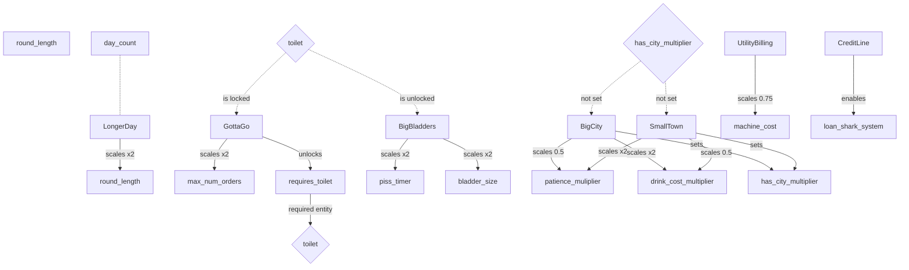

# Game Simplification Plan (Blue-sky Target; Breaking Changes OK)

**NOTE:** This file is superseded by the single consolidated doc:

- `docs/game_simplification_master.md`

This is the **single canonical plan**: it combines the “what’s wrong today” review with a **blue-sky ideal end state**, assuming we are free to make **breaking changes** (component removals/renames, system rewrites, factory redesign).

## Goals

- Reduce the number of gameplay concepts to a small set of reusable primitives.
- Make behavior live in **systems** (not in `entity_makers.cpp` lambdas).
- Make interaction/holding/work **one consistent pipeline**.
- Make new content creation **data-driven** (archetypes), not “edit 6 switches”.

---

## Current state (grounded in `src/entity_makers.cpp` + `src/system/*`)

### What entities are made of today

From `src/entity_makers.cpp`:

- **Baseline**: nearly everything has `Transform`.
- **Players**: input (`CollectsUserInput`, `RespondsToUserInput`), interaction (`CanHighlightOthers`), carrying (`CanHoldItem` + `CanHoldFurniture` + `CanHoldHandTruck`), identity (`HasName`, `HasClientID`), plus movement/render.
- **Customers**: movement + job (`CanPerformJob`, `CanPathfind`) plus many per-behavior AI components.
- **Furniture**: “base furniture” plus optional pieces (`CanHoldItem`, `HasWork`, `IsRotatable`, `CanBeHeld`, `CanBeHighlighted`, etc.).
- **Machines**: implemented mostly as `HasWork` lambdas inside factories, with some machine logic duplicated elsewhere.

### Biggest complexity hotspots

- **Interaction/holding is fragmented**:
  - 3 different “carry slots” (`CanHoldItem`, `CanHoldFurniture`, `CanHoldHandTruck`)
  - 2 “held flags” (`CanBeHeld`, `CanBeHeld_HT`)
  - held-by semantics also exist in `IsItem`
  - multiple systems update held transforms, and input contains rules about what collides when held
- **Machine logic is duplicated**:
  - draft tap “beer add” exists both in draft tap `HasWork` and drink `HasWork` (two sources of truth)
  - “auto add ingredient” exists as systems (soda fountain) and as work lambdas elsewhere
- **Trigger areas and containers are split into many micro-systems** with similar gating and repeated queries.
- **Factories are doing too much**:
  - they pick renderers, wire behavior via lambdas, and own a huge `convert_to_type()` switch.

---

## The blue-sky perfect end state (minimal concepts)

### 1) Minimal component model

#### Core
- `Transform`
- `Tags` (category flags)

#### Physics
- `Collider` (shape + layer/mask)
- `KinematicBody` (velocity / desired motion)

#### Interaction + carrying (the big simplifier)
- `Interactor` (reach + current focus + intent)
- `Interactable` (what interactions are allowed + requirements)
- `Inventory` (slots, e.g. hand/tool/carry)
- `Attachment` (child → parent + socket/offset rule)

This replaces the entire “holding ecosystem”:
- `CanHoldItem`, `CanHoldFurniture`, `CanHoldHandTruck`
- `CanBeHeld`, `CanBeHeld_HT`
- “held-by” state in `IsItem`
- multiple held-position systems

#### Work
- `Workable` (progress + action id + UI flags)

No callbacks stored in components.

#### Machines / crafting
- `Machine` (type id + input/output rules + timing)
- `DrinkState` (ingredients + metadata)
- `IngredientSource` (for bottles/tools that add ingredients; uses remaining; validation id)

#### AI
- `Agent` (single customer AI state machine data: state, targets, timers, memory)

#### Economy / store / progression
- `Wallet`
- `Priced`
- `StoreItem`
- `WorldTime` (singleton-like)
- `RoundRules` (singleton-like)

---

### 2) System architecture (one pipeline per domain)

#### World / state
- `WorldTimeSystem` (advance time, emit transition events)
- `RoundSystem` (upgrades/unlocks/spawning rules)

#### Input + interaction (one consistent pipeline)
- `InputSystem` → writes intent into `Interactor`
- `FocusSystem` → picks best `Interactable` per interactor
- `InteractSystem` → applies grab/place/use/work with consistent validation
- `AttachmentSystem` → updates transforms for attachments

#### Movement / physics
- `MovementSystem` (intent → velocity)
- `CollisionSystem` (resolve using collider masks)
- `NavSystem` (pathfinding requests + follow-path for AI)

#### Machines / crafting
- `MachineSystem` (machine execution, insertion/extraction rules)
- `CraftingSystem` (apply ingredient additions, consume uses, update `DrinkState`, emit sound/FX events)

#### AI
- `CustomerAISystem` (single state machine: queue → drink → pay → leave + side-quests)
- `QueueSystem` (shared line mechanics)

#### UI
- `UIHintSystem` (derives progress bars/speech bubbles/icons from state)
- `RenderPrepSystem` (resolve model variants)
- `RenderSystem` / `UISystem`

---

### 3) Entity creation: archetypes, not switches

Replace `convert_to_type()` and most of `entity_makers.cpp` with **archetype definitions**:

- `Archetype { components + defaults + tags }`
- Optional “constructor hook id” for the rare cases that truly require code.

This makes adding content look like:

- Add archetype data
- Add or reuse a machine/work/interaction rule id
- Done

---

## Concrete breaking changes (mapping old → new)

### Holding / interaction

- **Delete**: `CanHoldItem`, `CanHoldFurniture`, `CanHoldHandTruck`
- **Delete**: `CanBeHeld`, `CanBeHeld_HT`
- **Delete or repurpose**: `IsItem` “held by” semantics (replace with `Attachment`)
- **Replace** with: `Inventory` + `Attachment` + unified `InteractSystem`

### Work / machines

- **Delete**: `HasWork` callbacks/lambdas as the primary behavior mechanism
- **Replace** with: `Workable(action_id)` and a small action table in systems
- **Unify**: soda fountain, draft tap, ice machine, squirter, blender as `Machine(type_id)`

### AI

- **Delete**: per-behavior AI components (`AIWaitInQueue`, `AIDrinking`, etc.)
- **Replace** with: `Agent` (single component) + `CustomerAISystem`

### State

- **Replace** the “Sophie mega-entity owns everything” pattern with:
  - `WorldTime` + `RoundRules` on a dedicated world entity (or globals managed by systems)

### Systems cleanup

- **Merge** trigger area micro-systems into one `TriggerAreaSystem`.
- **Merge** container micro-systems into one `ContainerMaintenanceSystem` (or subsystems inside one file).
- **Centralize** gating (day/night/transition) into one shared run-context.

---

## Recommended “perfect” build order (still phased, but breaking is fine)

This is the fastest route to “everything feels simpler” (not the safest, but the cleanest).

### Step 1 — Unify interaction + carrying

Implement:
- `Interactor`, `Interactable`, `Inventory`, `Attachment`
- `FocusSystem`, `InteractSystem`, `AttachmentSystem`

Then delete the legacy holding ecosystem and remove special casing from input/collision.

### Step 2 — Move work out of factories

Implement:
- `Workable(action_id)` + `WorkSystem`

Convert:
- vomit cleaning
- toilet cleaning
- interactive settings changer
- draft tap fill

### Step 3 — Unify machines into one crafting/machine model

Implement:
- `Machine(type_id)` + `MachineSystem` + `CraftingSystem`

Convert:
- soda fountain
- ice machine
- draft tap
- blender + fruit → juice

This fixes duplicated logic (like beer tap) by construction.

### Step 4 — AI consolidation

Implement:
- `Agent` + `CustomerAISystem`

Convert customer behavior to a single state machine.

### Step 5 — Archetypes

Replace `convert_to_type()` with a registry/archetype table.

---

## “If we only do one thing” recommendation

Build the **unified Interaction + Inventory + Attachment pipeline** first.

It collapses the biggest current complexity cluster (holding/highlighting/pickup/drop/handtruck special cases) and makes machines + AI refactors dramatically simpler.

---

## What the blue-sky setup needs to support “coming soon” features

This section is based on the project’s planning docs (`todo.md`, `ideas.md`, `progression_tree.md`, `docs/game_brief.md`), and describes what the **perfect architecture** should look like *once these features are required*.

### A) Upgrades / modifiers with time windows (Happy Hour, themed nights, dynamic pricing)

**Requirement theme**

- Upgrades/modifiers that:
  - apply only during a time slice (mid-day, “once per store round”, etc.)
  - scale configuration values (spawn, price, patience, etc.)
  - add/remove behavior (loan shark debt recovery, utility billing, etc.)

**Blue-sky architecture support**

- `Modifier` / `Rule` system:
  - `RuleId` (e.g. `HappyHour`, `DynamicPrices`, `CreditLine`)
  - activation conditions: `TimeWindow`, `DayCount`, `InStore`, `InRound`, etc.
  - effects expressed as **data**:
    - config multipliers/additive deltas
    - enabling/disabling systems
    - adding archetypes to store pools / spawn pools
- `WorldTime` exposes phase + “time-of-day percent” so rules can gate cleanly.

### B) Automation progression (Factorio layer / jams / spill hazards / auto-clean)

**Requirement theme**

- Conveyors/grabbers/pipes/squirters evolve into late-game logistics.
- Backups cause physical consequences (spills, slip hazards).
- “Auto-cleaning suite” (mop buddy, bidet, etc.).

**Blue-sky architecture support**

- Logistics as a first-class domain:
  - `Belt`, `Inserter`, `PipeEndpoint`, `Router` components (or `Machine(type_id)` specializations)
  - `ItemFlow` / `TransportState` for “in transit” items (instead of embedding flow state in disparate components)
  - `JamSystem` producing world entities (`Spill`, `Hazard`) when throughput fails
- Cleanup as a normal “work” action:
  - `Spill` / `Hazard` uses `Workable(action_id="clean_spill")`
  - Mop buddy is just an `Agent` that targets `Workable(clean_spill)` entities

### C) Customer variety + traits (thieves, loud/rude, speedwalkers, chatty, etc.)

**Requirement theme**

- Customers have persistent/temporary traits affecting:
  - walk speed
  - order/patience/pay timing
  - theft behavior + detection/counters

**Blue-sky architecture support**

- `Traits` / `StatusEffects` component on customers:
  - list of `TraitId` with parameters
  - systems translate traits into numeric modifiers (speed, patience drain, etc.)
- AI remains one `Agent` state machine, but:
  - has branches for thief behavior
  - can emit “crime events” consumed by detectors / security systems

### D) Groups, multi-orders, high-volume serving (pitchers, flights, “birthday shots”)

**Requirement theme**

- Group arrivals, one order for group, multiple drinks, bulk containers.
- Items like pitchers hold “N servings” of a recipe.

**Blue-sky architecture support**

- Orders become structured data:
  - `Order` = one or more `LineItems` (drink id, count, constraints)
  - group entity or group id associated with multiple customers
- `DrinkState` supports:
  - single-serve
  - multi-serve container (pitcher: servings remaining; flight: multiple distinct contents)

### E) VIP / zones / priority routing (red carpet, priority register, chalkboard “try this”)

**Requirement theme**

- Spatial zones that affect:
  - who can order where
  - what they order
  - pricing and tips

**Blue-sky architecture support**

- `Zone` entities (or tagged polygons/rects) with rules:
  - `ZoneId` + `ZoneEffects`
- `FocusSystem` / `InteractSystem` consult zone rules for eligibility.
- `CustomerAISystem` consults zone rules for register selection and order generation.

### F) Alternate ordering modes (tablet ordering, kiosks, mobile preorder, pickup later)

**Requirement theme**

- Customers can order without standing in a physical line, pick up later, or order before entering.

**Blue-sky architecture support**

- `OrderQueue` is a real system, not “the register owns the line”:
  - `OrderSource` (register, tablet, kiosk, mobile)
  - `Fulfillment` rules (where/how pickup occurs)
- Customers have AI states for:
  - waiting elsewhere while order is prepared
  - pickup behavior

### G) Minigames as upgrades (rhythm mixing / DDR / diagetically triggered)

**Requirement theme**

- A diagetic trigger area that runs a minigame once per round, producing rewards (discount/overclocking/frenzy).

**Blue-sky architecture support**

- `MinigameStation` entity:
  - `MinigameId`, participation rules, cooldown (“once per round”)
  - emits `GameEvent` on completion: `{score, reward_type}`
- Reward effects are implemented as `RuleId` activations or temporary `Modifier`s.

### H) Economy extensions (rent, utility billing, debt recovery / loan shark)

**Requirement theme**

- Weekly rent deadlines, daily operating costs, debt recovery instead of game over.

**Blue-sky architecture support**

- `EconomySystem` with:
  - scheduled charges (rent, utilities)
  - debt state + recovery behavior as a rule
- “Transactions” are data events consumed by UI, not bespoke animation logic.

### I) Map generation/playability constraints

**Requirement theme**

- Map generation must guarantee pathability and required entity placement (see `docs/map_playability_spec.md`).

**Blue-sky architecture support**

- Treat “map validation” as a first-class system:
  - run validators on an “ASCII seam” output before spawning runtime entities
  - provide deterministic retry and reason codes
- Spawn archetypes from the validated seam (no ad-hoc post-fixes in gameplay systems).

---

## Appendix — Source planning docs (verbatim)

### `todo.md`

```markdown
---

kanban-plugin: basic

---

## backlog

- [ ] WARN: need a way to warn that UI elements are offscreen "purpling"
- [ ] Add "powered by raylib" intro card (and other intro cards) like cat v roomba: https://github.com/raysan5/raylib-games/tree/master/cat_vs_roomba/src
- [ ] Create Doors
- [ ] Add a pause menu with textual options
- [ ] Add system for exporting resources to code for easier binary packaging ([see branch packager](https://web.archive.org/web/20210923054249/https://veridisquot.net/singlefilegames.html))
- [ ] Create Nav mesh for "walkability"
- [ ] Add some way for entities to subscribe to certain keys so we can more easily keep track of what keys are being requested over lifetime
- [ ] Fix corner walls
- [ ] Upgrade Astar to ThetaStar (worth doing?)
- [ ] support for tile sheets
- [ ] Consider using https://github.com/raysan5/rres for resources
- [ ] Particle system?
- [ ] Spritesheet animator
- [ ] consider switching to https://github.com/graphitemaster/0xABAD1DEA for all of our static globals
- [ ] Look into if its worth using fmod for sound: https://www.fmod.com/
- [ ] Investigate Fiber jobs: http://gdcvault.com/play/1022186/Parallelizing-the-Naughty-Dog-Engine
- [ ] Create / Use a flatmap/flatset for better cache locality on smaller data sets
- [ ] Should we be using arena allocators?


## infra changes

- [ ] collision for player to change to cylinder
- [ ] pressing two movement at the same time while moving camera sometimes feels weird
- [ ] In pause menu, remap key bindings in layer for arrows keys to choose options
- [ ] rendering oreder for text background is weird
- [ ] likely dont need to queue network packets since we always send the full state

- [ ] AttachmentSystem (+ Attachment/Attachable): unify held item/furniture/handtruck/rope via generic parent→child attachment with local offsets/orientation/collidability; removes duplicated update math and special-cases; reduces desyncs.
- [ ] Progress/Cooldown components + ProgressRender: centralize timers/progress bars (work, patience, fishing, triggers) and a single HUD/bar renderer; fewer bespoke render paths and less UI drift.
- [ ] TriggerAreaSystem: own entrants counting, validation, progress/cooldown and activation; removes scattered trigger logic and TODOs in systems; clearer round/lobby/store flows.
- [ ] GameState change hooks (StateManager on_change): register once to handle player moves, store open/close, resets; eliminates manual cross-calls sprinkled across systems; safer transitions.
- [ ] Entity Tags/Groups (+ TaggedQuery): bitset tags like Store, Permanent, CleanupOnRoundEnd; simplifies queries and bulk operations; replaces ad‑hoc include_store_entities and type checks.
- [ ] EntityRegistry (id → shared_ptr): O(1) lookup for ids; removes linear scans in helper; safer hand-offs for systems needing shared ownership.
- [ ] CollisionCategory/CollisionFilter components: data-driven collision layers and exceptions (e.g., attached items, MopBuddy/holder, rope); replaces hardcoded branches in is_collidable; easier to reason about.
- [ ] PrefabLibrary (data-driven entity builders): move repetitive makers to JSON prefabs (like drinks/recipes already); shrinks large makers file; reduces human error and speeds iteration.
- [ ] BillboardText/WorldLabel component + system: single way to draw floating names/prices/speech bubbles/progress labels; consistent styling/sizing and fewer one-offs.
- [ ] Ability + Cooldown pattern: normalize “do work” interactions (squirter, indexer, adds_ingredient) using Progress/Cooldown; reduces bespoke timers/flags and makes balance easier.
- [ ] LifecycleSystem (deletion/cleanup policies): tag-driven bulk delete/persist on state changes; removes bespoke cleanup loops and TODOs about tagging.
- [ ] EventBus (GameEvents): small pub/sub around existing event pattern for AttachmentChanged, TriggerActivated, UpgradeUnlocked, StateChanged; decouples systems and reduces globals traffic.
- [ ] TransformFollower sockets (named anchors): define front/right/top sockets for precise child placement while following; deletes face-direction math scattered across updates.
- [ ] InputContext system: drive KeyMap by context (Menu/Game/Paused) instead of hardcoding; clarifies input paths and fixes edge-cases when menus overlap gameplay.

// merged from afterhours planning
- [ ] vendor/afterhours: switch all includes to the local wrapper `src/ah.h` (ensures `ENABLE_AFTERHOURS_BITSERY_SERIALIZE` and bitsery includes). Update: `src/layers/gamelayer.h`, `src/job.h`, `src/components/base_component.h`, `src/entity.h`.
- [ ] vendor/afterhours: stop including internal headers like `afterhours/src/base_component.h`; include only the public `afterhours/ah.h` via our wrapper.
- [ ] vendor/afterhours: centralize serialization on vendor implementations. Enable `ENABLE_AFTERHOURS_BITSERY_SERIALIZE` via build flags and remove local serializers for `afterhours::Entity` and `afterhours::BaseComponent` in `src/entity.h` and `src/components/base_component.h`. Verify network roundtrips.
- [ ] vendor/afterhours: standardize on `afterhours::Entities`/`afterhours::RefEntity` aliases; remove duplicate `using` aliases in `src/entity_helper.h` and elsewhere.
- [ ] vendor/afterhours: evaluate migrating `EntityHelper` functionality (create/get/delete, range/collision queries, cleanup) to vendor equivalents to reduce duplication; replace linear scans with registry/lookup if provided.
- [ ] vendor/afterhours: compare our `EntityQuery` to vendor query APIs; if equivalent (whereHasComponent/whereInRange/orderByDist), migrate usage to vendor to shrink maintenance.
- [ ] vendor/afterhours: review job/task facilities; decide whether to adapt `src/job.h` to vendor API or keep custom; document decision.
- [ ] vendor/afterhours: check for vendor component-registration utilities for polymorphic serialization; replace manual `MyPolymorphicClasses` maintenance if available.
- [ ] vendor/afterhours: ensure submodule is initialized and pinned (`.gitmodules`); build uses `-Ivendor/` include path. Add CI guard to fail if submodule missing. Resolve nested submodules (e.g., `vendor/cereal`) by adding URLs or vendoring headers to avoid update failures.

## code health (readability, stability, and build hygiene)

- [ ] Create a precompiled header (pch.hpp) for heavyweight third-party headers (raylib/rlgl/raylib, fmt, nlohmann/json, bitsery, magic_enum, argh) to reduce compile times
- [ ] Split src/engine/graphics.h into graphics_types.h (types + declarations, no raylib includes) and graphics.cpp (definitions); move operator<< implementations out of the header
- [ ] In src/engine/model_library.h, forward declare `namespace raylib { struct Model; }` and move raylib includes and model conversion logic into a new model_library.cpp
- [ ] Introduce a lightweight network/fwd.h or network/api.h used by src/game.cpp instead of including heavy network/network.h; refactor call sites accordingly
- [ ] Run Include-What-You-Use (IWYU) across src/; add a scripts/run_iwyu.sh that consumes compile_commands.json and fix reported over-includes
- [ ] Reduce transitive includes in public headers: include only what you use, prefer forward declarations for Files, Library, Singleton where only refs/pointers are needed
- [ ] Avoid including <raymath.h> and <rlgl.h> from headers; include them only in .cpp files that need them
- [ ] Isolate template-heavy headers (bitsery, serialization) to dedicated headers included only by .cpp that need them; avoid pulling them into broadly included headers
- [ ] Add -ftime-trace to a build target to profile compile hotspots and track before/after improvements; check in a short report
- [ ] Enable sanitizers in Debug builds: ASan + UBSan by default; TSan for network tests
- [ ] Add clang-tidy with bugprone-*, clang-analyzer-*, cppcoreguidelines-*, readability-*, performance-*; wire it into CI and a local script
- [ ] Turn warnings into errors in CI and raise warning level: -Wall -Wextra -Wshadow -Wconversion -Wsign-conversion -Wold-style-cast -Wimplicit-fallthrough
- [ ] Strengthen types: replace naked int/float parameters with enum class and strong typedefs (EntityId, PlayerId); use std::chrono for durations
- [ ] Prefer std::unique_ptr/std::shared_ptr for ownership; use gsl::not_null for non-owning pointers
- [ ] Add RAII wrappers for raylib resources (Model/Texture/Sound) with proper unload in destructors to prevent leaks and double-frees
- [ ] Use tl::expected (vendor expected.hpp) for fallible operations (file IO, network parsing) instead of bool/error out-params
- [ ] Apply [[nodiscard]] and noexcept where appropriate for public APIs to catch ignored results and enable better codegen
- [ ] Add unit tests for serialization/deserialization (e.g., ModelInfo) and basic network message round-trips; add fuzz tests for malformed inputs
- [ ] Add guard helpers for index/bounds checks and precondition asserts; replace undefined behavior with explicit errors
- [ ] Add a crash handler with backward-cpp to capture symbolized stack traces in Debug builds
- [ ] Document include policy and code style; add a pre-commit hook to run format, clang-tidy (local-only), and basic static checks
- [ ] Audit and minimize global/singleton usage; make access thread-safe or pass explicit context; wrap network:: globals with atomics or accessors


## no repro

- [ ] cosmopolitan model is invisible
- [ ] PS4 Controller touchpad causing “mouse camera rotation”<br>clicking the touchpad & analog stick in the opposite direction cam rotates that way


## design decisions

- [ ] Simple Syrup doesnt dissapear after one use and its kinda the only one that does that…
- [ ] penalty if you make too much extra? waste too much ingredients
- [ ] Text doesnt rotate based on the camera
- [ ] Not clear you can cycle through alcohols
- [ ] guys keep coming back to register. eventually need to add money system or something
- [ ] Should alcohol have to be put back? should it be like the soda / simple syrup
- [ ] add practice mode to learn recipe
- [ ] why should you clean up the bar? do people not want to come in? <br><br>cant serve until its clean?
- [ ] Should the roomba only spawn by default for single player games? Should it spawn at the beginning ever?
- [ ] warn player when they are deleting something that we need
- [ ] need to add some ui to saw how many or when more people will spawn as its not clear
- [ ] should customers be able to look like players?
- [ ] add an are you sure? when switching resolution and languages
- [ ] settings dropdown doesnt respect selected language
- [ ] - more likely to vomit if they waited longer for their drink ?
- [ ] should the day be longer based on number of customers
- [ ] - waiting reason overlaps with customer count at 1600x900 but not 1080p<br><br>- fixed but need to look into how the sizing works cause it should be proportional
- [ ] - should alcohols be multi-use and then you throw out the empty bottle
- [ ] - patience for first round should be double or triple?
- [ ] - not enough customers to need automation?


## broke

- [ ] mojito model is big square
- [ ] mai tai has no model
- [ ] having pathfinding crashes when rendering the waiting queue (disabled it for now )
- [ ] lime doesnt want to go into drink when cup is in register
- [ ] lime wont go in unless i add lime juice first?
- [ ] toilet hitbox is messed up
- [ ] - vomit hitbox is hard especially without mop

## complete

**Complete**
- [x] joining twice from a remote computer crashes the host
- [x] drop preview box sometimes has the wrong color
- [x - bug where you cant place the table next to the register<br>- => (i’ve disable bounds checking on placement for now)
- [x] Cant repro but i got the FF box to show trash icon inside. putting it back in the trash and taking out fixed it
- [x] remove job system and switch to just tons of components HasPath, CanWaitInQueue, CanIdle, CanMop, etc
- [x] add reroll to shop
- [x] need preview for where item will go
- [x] Tell the player how many customers are coming this round
- [x] hard to tell that a new machine/stockpile has been spawned in after you get an upgrade
- [x] at round 3 the people got stuck in line as if there was an invis person at the front
- [x] highlight spots on the map where this thing can go
- [x] day 3 doesnt work, i think it skips unlock screen and that breaks it
- [x] During planning its hard to know what each machine it, not obvious
- [x] default language is reverse which is confusing
- [x] vomit is broken not working
- [x] Add purchasing medicine cab
- [x] Roomba keeps getting stuck at exit
- [x] BUG: Hide pause buttons from non-host since they dont really do anything anyway
- [x] Client player cant change settings because menu::State is being overriden by host
- [x] - you can fill up the cup while its in the cupboard
- [x] We probably need some way in Progression screen to know what the new drink's recipe is like
- [x] if you take the drink back from the customer you crash
- [x] Automatically teleport new players when joining InRound / Planning etc
- [x] controls dont work for gamepad in settings during game

%% kanban:settings
```
{"kanban-plugin":"basic"}
```
%%
```

### `ideas.md`

```markdown
# Pub Panic! - Idea Inventory
- (is this too close to plate up?) 
- AI players need items they want ("Orders")
- Small / Medium / Large bottle
- How do upgrades work?
    - Options: Deterministic Skill Tree or RNG + money(Like Plateup)
- Draughts station
    - Auto-fill upgrade? 
- POS System
    - Automatically takes payment (Square ipad) 
- Generic stocking
    - Canned beers and sodas
    - Able to load up a whole shelf at a time
    - Grab box from pallet and drop on shelf to refil 
    - Each pallet holds 10 refills
    - How to get a new pallet
- Cash Register
    - multiple lines per register
    - People at register dont lose patience
        - Or maybe lose patience when not floating still and regenerate a little bit on snapping
- Conveyer belts or tractor beam
- Cleaning bar after use, otherwise risk losing order spot 
- Rerolls have chance for really rare things (sloth in SAPs)
- Difficulty modifiers 
    - SpeedWalkers: Customers walk 1.5x as fast
    - Social Drinkers: Customers always order multiple drinks
    - Self Medicated: Customers order spirits only 
    - Chatty Drinkers: Customers spend twice as long to explain their order
    - Bad Insurance Rates: make half as much money 
    - Curious customers: Customers ask questions while paying 
        - Decrease patience of other customers in the same line (implicitly)
    - Chatty Customers: Customers take twice as long to pay
        - Need some jokes
    - Mummblers: Customer orders are harder to read 
    - Bad Fins: You walk slow? Get tired more easily? Have to rest? 
- Different game modes
    - 
- Customers have attributes?
    - Loud customers (giant speech bubble) 
    - Rude customers () 
    - Drunk customers ()
- Allow players to exchange held items?

## About

Pub Panic! is a simulation game where players manage a high-energy urban bar. As the bartender, players must keep their customers satisfied by serving drinks quickly and efficiently. Success is measured by maximum throughput and meeting the weekly financial targets (The Rent).
best out of the group i think: 
Mixology Mayhem
Tipsy Tavern
"Pub Panic"
Pub Party Panic
Pub Pandemonium
"Sips & Shenanigans"
"Cheers & Chaos"
Whimsy Tavern
Tipsy Troubles
Spirited Shenanigans
Cocktail Capers

Some I like the vibe of but im not 100%: 
Tipsy Teamwork
Boozy Blitz
Cocktail Carousel
Cocktail Conundrum
Cocktail Commotion
Pour Perfect
Mixer Madness
Topsy-Turvy Tavern
Tipsy Toasters
Fizzy Fiasco

Ones I dont like at all: 
Cocktail Circus
Mix Masters Mayhem
Fizzing Frenzy
Boozy Bartender Bonanza
Sip & Serve Soiree
Whimsical Whiskey Bar
Bartender's Bliss
Mixologist Madness
Topsy-Turvy Tap House
Booze Brigade Bash
Pour & Party Palooza
The Whiskey Wizards
Tipsy Tricks & Treats
Bubbly Banter
Mix & Mingle Mania
The Tipsy Tumult
Bubbly Buzz
Cocktail Craziness
Boozy Balancing Act
Party Mix Masters
Bubbly Bartenders
Sip & Serve Shindig
Tipsy Tumultuous Tavern
Whimsical Wine Bar
Cheery Drink Dash
Pour & Party Pandemonium
Bubbly Blend Brigade
Booze & Buzz Bonanza
Topsy-Turvy Taproom
Sip & Stir Struggle
Party & Pour Palooza
Jovial Juggling
Quirky Quaffs
Bubbly Bounce Bonanza
Tipsy Tiki Time
Mix & Mingle Madness
"Drink Dispatch"
"Fizz Frenzy"
"Drink Crafting Craze"
"Bar Brawl Brigade"
"Drink Dash Dilemma"
"Mixology Madness"
"Drink Riot"
"Brewery Blitz"
"Tipsy Teammates"
"Boozy Brawl"
Bartender's Banquet
Drink Dexterity
"Brewery Buzz"
Brewmaster Brigade
Party Mix Masters
Bartender's Best
"Bartender Bonanza"
"Serving Frenzy"
Bartender Bonanza
Pub Craze
Drink Dash
"The Bartender Brigade"
"Drinktastic!"
"Beverage Blitz"
Barkeep's Challenge
Pub Pizzazz
Mix & Mingle Mayhem
Sip & Serve Shuffle
Tipsy Tumult
Fizzy Frenzy
Cheery Cocktails
Bubbly Bonanza
Boozy Banter
Pour & Party
Sip & Stir Stir
Party & Pour Pandemonium
Jovial Mixology
Booze & Bounce Bash
Mix & Match Mania
Fizz & Funfair
Quirky Cocktails
Bubbly Bounce

Cocktail Umbrellas 
VIP Area  (red rope) 
Robots 
Drink order kiosk with delivery 
Sticky Hand 

Gatcha machine to get new items? 
Card Parks to get new items? 
```

### `progression_tree.md`

```markdown
Edit on https://mermaid.live/ 

What happens when people drink way way too much 
bouncer

Some upgrade ideas: 

ddr 
(i had actually built a ton of this but im bad at git so its gone now :( )
The idea is that there is an upgrade where it adds a new trigger area to the store 
one player can stand on it and play a rhythm game. 
based on their score they will get a discount on their next purchase. 
you can only play once per store round. 
originally i was going to make it a UI based but it might actually be simpler for me to make it diagetic like the piano in Big. 
- do we care about other players being able to see? 
- do we want other players to be able to help? (i think we should not let them) 
- doing it diagetically means custom entity type 
- hit 100% of notes get 100% of discount? or 5 notes get 20% off for each? 
- how to handle hitting iwhen too far away, is that a partial point etc? 
- pointer for direction vs timing 

plunger minigame 

having to check id 

limited inventory 

five finger discount
dont mind if i do
(customers sometimes will steal bottles from behind the bar) 
(whats the benefit)

metal detectors
**beep**
(customers who pass through and havent paid come back and pay)

Me and Mrs Jones
you know i heard they have a thing going on 
(double customers but some will stop other customers from drinking more and take them home)

Sustainable
damn have you see their dumpster
(less customers but lose money for every ingredient used but not served)
(maybe this is a themed one)

Pub Crawl
nah man this is our twelveth place today
(customers come more often in groups but order only beers)

Multiple Floors
(club theme) 

Happy Hour
- more people in the middle of the day
- but less money during that time (like 3/4 price but double orders) 

Dynamic Prices
(the longer the lines the more drinks will sell for)

Utility Billing
(Machines are 25% cheaper to purchase but incur daily operational costs)

Credit Line
(Missing rent triggers the Loan Shark instead of Game Over)

Tablet Ordering
(customers will order and will pick it up later)

Other types of cups
(more tip if you match the cup with the drink) 

Red Carpet 
(adds a red carpet area that must have its own register, spawns a VIP customer)

Going Green / bottle deposit
(customers return their empty cups for reuse)

Speakeasy
(tips scale with travel distance)

Regulars
(remember who ordered what)

Pitcher / flights / crafting beer

Champagne (sword / QTE)

Tea/Coffee pots (fill pot with water; graduated progress bar)

Fire code / bouncer / club theme


```

### `docs/game_brief.md`

```markdown
# Game Brief: Pub Panic!

## One-Sentence Pitch
"Overcooked but you can eventually automate it."

## Core Game Concept
Pub Panic! is a **Systemic Volume Roguelite** where players manage a high-energy urban bar. Success is measured by maximum throughput and meeting the weekly financial targets (The Rent), rather than perfect service.

## The Loop
1. **The Day (Manual Scrambling)**: Players frantically serve drinks. High-skill manual actions (Rhythm Mixing) allow for "overclocking" machines and triggering map-wide Frenzy boosts.
2. **The Night (Strategic Upgrading)**: Use daily profits to buy new furniture, ingredients, and **Automation Modules**.
3.- **The Endless Loop**: Transition from manual labor (Day 1) to a fully automated "Factorio" style machine (Day 30+). The game continues until you can no longer pay the mounting rent.

---

## 🏛️ Core Design Pillars

### 1. Physicality Over UI
- **Diagetic Information**: Minimal screen-space UI. Character attributes like "Bladder Size" or "Patience" are reflected in animations or speech bubbles, not health bars.
- **Physical Interactions**: The "Rhythm Mixing" game is a series of floor tiles that light up in-world. Automations like Squirters or Grabbers are high-detail mechanical models.

### 2. High-Throughput Chaos (The "Back-up" Rule)
- While mechanics are **deterministic** (logic-consistent), complexity brings risk.
- **The Jam**: If a belt isn't emptied fast enough, items don't just "stop"—they begin to pile up or spill onto the floor, creating a slip hazard (Vomit-logic cleanup required).

### 3. Co-op Scaling
- **Dynamic Challenge**: Rent and Customer Spawn Rates scale linearly with player count.
    - `Target Rent = Base Rent * (0.5 + 0.5 * Number of Players)`
    - `Spawn Rate = Base Rate * (0.8 + 0.2 * Number of Players)`

---

## Key Features & Mechanics

### 🏗️ Logistics & Automation (The "Factorio" Layer)
The core of the late-game experience is automating the chaotic manual loop into a high-throughput machine.
- **Conveyor Belts**: Primary transport for items; can be used to route cups from dispensers to filling stations.
- **Filtered Grabbers**: Intelligent arms that extract items based on type (e.g., only grab "Dirty Cups" or "Full Pitchers").
- **Pneumatic Pipes**: High-speed, instant teleportation for specialized high-volume routing.
- **Squirters & Dispensers**: Fixed alcohol/soda cabinets that auto-fill cups when placed underneath or delivered via conveyor.
- **Tractor Beams**: Magnetic extraction for pulling items toward specific "loading zones."
- **Auto-Cleaning**: 
    - **Mop & Holder**: Basic manual spill cleanup.
    - **Roomba (MopBuddy)**: Automated cleaning bot that patrols for spills/vomit.
    - **Bidet**: Bathroom upgrade that increases the number of uses before cleaning is required, reducing overall mess frequency.
- **Handtruck**: Specialized tool for moving multiple boxes or large furniture items simultaneously, critical for during-round layout adjustments.

### 🍸 Bar & Service Mechanics
- **Pouring & Mixing**: 
    - **Manual**: Timer-based barrels (Beer), Spouts (Soda), and Blender (Rhythm-based tapping).
    - **Automated**: Juice Press (auto-juicing) and Beer Wall (self-serve for customers).
- **Rhythm Mixing (Vision)**: A diagetic "Big Piano" or DDR-style minigame area. Players stand in the trigger zone to play a rhythm game (once per round). 
    - **Reward**: High scores trigger map-wide "Overclocking" or significant discounts on the next purchase.
- **Advanced Recipes**:
    - **Pitchers**: Can hold up to 10x the same drink, allowing for group serving.
    - **Flights**: Holds 4 unique liquids for high-end craft beer orders.
    - **Champagne**: Requires a sword-swinging QTE to open; perfect timing yields higher tips.

### 👥 Customer AI & Systems
Customers possess varying attributes that dictate the bar's "vibe" and challenge level:
- **The Loop**: Entrance -> Queue -> Order -> Drink/Wander -> Bathroom (if "Break the Seal" is active) -> Pay.
- **Attributes**: 
    - **Thieves**: Targets bottles and high-value items; identified by specific visuals and countered by **Metal Detectors**.
    - **Loud/Rude**: Giant speech bubbles and faster patience decay.
    - **SpeedWalkers**: 1.5x walk speed, increasing foot traffic chaos.
    - **Chatty Drinkers/Customers**: Double the time taken to order or pay at the register.
- **Bladder System**: Bladder size is hidden initially; "Break the Seal" halves bladder size after the first use, creating a "bathroom rush."

### 📈 Roguelite Upgrades & Progression
- **The Rent**: A weekly (multi-round) mounting financial target. Failure ends the run unless the **Credit Line** upgrade is active.
- **The Locker**: Persistent storage vault allowing players to save high-value items or one drink between rounds.
- **Scaling Upgrades**:
    - **Happy Hour**: 2x customer spawns, 0.75x drink cost. Occurs at mid-day.
    - **Dynamic Prices**: Drink costs scale linearly with the length of the queue.
    - **Membership Cards**: Significant upfront cash injection in exchange for a higher minimum customer floor.
    - **$10k Beer**: 0.5x customer spawn rate, 2x drink cost (Exclusive "Luxury" theme).
    - **Speakeasy**: Tip multiplier is calculated based on the maximum pathfinding distance from entrance to order point.

### 🎭 Seasonal & Themed Modifiers
- **Themed Nights**:
    - **Karaoke**: Customers order the *same* drink as the person before them in line.
    - **Live Music**: Increased re-order frequency, but the band consumes physical floor space and blocks paths.

---

## Aesthetic & Vibe
Urban, chaotic, and energetic. A realistic city bar reflected through a systemic lens. High-volume, high-stress, high-reward.

---

##  Economy & Strategy Math
The game's economy is designed for high-volume systemic scaling.

- **Drink Pricing**: Calculated dynamically based on complexity.
    - `Base Price = (Number of Ingredients * 5) + (Number of Prereqs * 10)`
- **Tipping Logic**: Tips are highly dependent on speed of service.
    - `Tip = CEIL(Drink Price * 0.8 * Patience Percentage)`
- **Speakeasy Multiplier**: If the "Speakeasy" upgrade is active, prices scale based on pathfinding distance.

---

## 📈 Upgrade Manifest (Technical Specs)
All upgrades permanently modify the global `ConfigData` state.

| Upgrade | Direct Effect | Economic/Game Modification |
| :--- | :--- | :--- |
| **Longer Day** | `RoundLength` x2.0 | Doubles time available to earn rent. |
| **Unlock Toilet** | `MaxNumOrders` x2.0 | Unlocks `is_toilet.h` loop; required for "Big Bladders." |
| **Big Bladders** | `PissTimer` x2.0, `BladderSize` x2 | Customers stay in bathroom longer but go less often. |
| **Bidet** | Mess Reduction | Increases uses before cleaning required. |
| **Main Street** | `CustomerSpawn` x2.0 | Massive volume increase; high pressure. |
| **Break the Seal** | `BladderSize` / 2 after 1st visit | Higher bathroom frequency as the night goes on. |
| **Speakeasy** | Tip % scales with distance | Encourages long, winding bar layouts. |
| **Membership Card** | Flat cash upfront | Increases `MinCustomerSpawn` for 3 days. |
| **$10k Beer** | `CustomerSpawn` x0.25, `DrinkCost` x2 | Extreme low-volume, high-margin luxury niche. |
| **Utility Billing** | Machine Cost x0.75 | Machines are 25% cheaper but incur daily operational costs. |
| **Credit Line** | Enable Debt Recovery | Missing rent triggers the **Loan Shark** instead of Game Over. |
| **Automatic Maker** | Automation Tier 3 | Station builds recipes from raw ingredients. |
| **Vacuum Sealer** | Inventory Persistence | Save 1 drink across day transitions. |
| **Priority Register** | Intelligent Routing | Special register that only accepts specific drink types. |
| **VIP Red Carpet** | Target Marketing | Customers on rug pay 3x but only order most complex drinks. |
| **Flash Sale Board** | Targeted Volume | Place a finished drink here to boost that order frequency +50%. |
| **Ingredient Silos** | (Maybe) Bulk Storage | Connected via pipes; removes manual refilling. |
| **Fragrance Diffuser** | (Maybe) Patience Buff | Slower patience decay / Faster bladder fill. |

---

## Recipe Bible
Drinks are loaded from `resources/config/drinks.json` and require specific ingredients and equipment prereqs.

- **Standard Pours**:
    - **Cola**: Soda (1 ing) -> $5
    - **Beer**: Beer (1 ing) -> $5
- **Mixed Drinks (Base + Alcohol)**:
    - **Rum & Coke**: Soda + Rum (2 ings) -> $10
    - **Screwdriver**: Orange Juice + Vodka (2 ings + Orange prereq) -> $20
- **Advanced Cocktails (3+ Ingredients)**:
    - **Margarita**: Tequila + Lime Juice + Triple Sec (3 ings + Lime prereq) -> $25
    - **Cosmo**: Vodka + Cranberry Juice + Lime Juice + Triple Sec (4 ings + Lime/Cranberry prereq) -> $40
    - **Mojito**: Rum + Lime Juice + Soda + Simple Syrup (4 ings + Lime prereq) -> $30
- **High-Volume Specialist**:
    - **Beer Pitcher**: Beer (10x volume) -> $50 (Requires Archer Cupboard)
- **Luxury Service**:
    - **Champagne**: Champagne (1 ing) -> $5 (requires saber QTE for higher tips)

---

## 🔒 Feature Completion Checklist
This list tracks the implementation status of all "Locked" features.

### 🏗️ Logistics
- [x] **Conveyor Belts** (`conveys_held_item.h`)
- [x] **Filtered Grabbers** (`indexer.h`)
- [x] **Pneumatic Pipes** (`is_pnumatic_pipe.h`)
- [x] **Squirters** (`is_squirter.h`)
- [ ] **Automatic Drink Maker** (Recipe-fed station)
- [ ] **Vacuum Sealer** (Persistence slot)
- [ ] Tractor Beams (Magnetic loading zones)
- [ ] Auto-Cleaning Suite
    - [x] **Roomba (MopBuddy)** (`ai_clean_vomit.h`)
    - [ ] Bidet (Mess-reduction capacity upgrade)
- [x] **Handtruck** (`can_hold_handtruck.h`)

### 🍸 Bar & Service
- [ ] Rhythm Mixing System (Diagetic Trigger + "Overclock")
- [ ] Advanced Recipe Support (Flights, Sword-Saber QTE)
- [ ] **Red Carpet / VIP Area** (Most expensive drink orders only)
- [ ] **Priority Register** (Specific drink-type filtering)
- [ ] **Flash Sale Chalkboard** (Drink-priority display)
- [x] **Recipe Book System** (`recipe_library.h`)
- [x] **Machine Suite** (Juice Press, Soda Fountain)

### 👥 AI & Systems
- [x] **Core Customer AI** (Drink -> Wander -> Bathroom -> Pay)
- [x] **Attribute System** (Loud, Rude, Drunk, SpeedWalker)
- [ ] **Thief AI** (Item Snatching logic)
- [ ] **Bladder System** (Break the Seal hidden state)
- [ ] **Metal Detectors** (Thief detection furniture)
- [ ] **Fire Code Logic** (Max capacity / wait-outside queue)
- [ ] **Fragrance Diffuser** (Patience/Bladder scaling system)

### 📈 Upgrades & Modifiers
- [ ] **Scaling Logic** (Happy Hour, Dynamic Pricing)
- [x] **Themed Nights** (Live Music / `ai_play_jukebox.h`)
- [ ] Karaoke (Order mimicry loop)
- [x] **Persistence** (`is_progression_manager.h` / The Locker)
```


