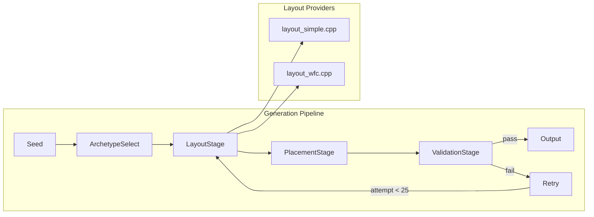

# Map Generation Plan (PharmaSea)

This document is a **planning note only**. It outlines a roadmap to update map generation without prescribing immediate code changes.

## Implementation Status Summary

| Phase | Status | Key Files |
|-------|--------|-----------|
| Phase 1 — Playability Spec | **COMPLETE** | `docs/map_playability_spec.md`, `src/map_generation/playability_spec.h` |
| Phase 2 — Explicit Pipeline | **COMPLETE** | `src/map_generation/pipeline.cpp`, `day1_required_placement.cpp`, `day1_validation.cpp` |
| Phase 3 — WFC Under Pipeline | **COMPLETE** | `src/map_generation/layout_wfc.cpp`, `ascii_grid.cpp` |
| Phase 4 — Regression Coverage | **COMPLETE** | `src/tests/test_map_playability.h` (seed suite with 20 seeds) |
| Phase 5 — Generator Decision | **COMPLETE** | `docs/map_generator_decision.md` |
| Phase 6 — New Generator | Not Started | Room-graph / BSP selected |

## Current Architecture

**Archetype probabilities** (from `pipeline.cpp::pick_archetype_from_seed`):
- OpenHall: 40%
- MultiRoom: 35%
- BackRoom: 15%
- LoopRing: 10%

**Key implementation files**:
- `src/map_generation/pipeline.cpp` — orchestration with retry loop
- `src/map_generation/day1_required_placement.cpp` — places R, C, S, d, g, f, +, t
- `src/map_generation/day1_validation.cpp` — ASCII + routing checks
- `src/map_generation/ascii_grid.cpp` — utilities (BFS, normalize, scrub)
- `src/map_generation/playability_spec.h` — code-level spec with `validate_ascii_day1()`

## Context (current architecture)

- **ASCII seam**: Map generators ultimately produce a `std::vector<std::string>` “tile map”. A single step (ASCII → entities) spawns entities and then validates.
- **Generators available**:
  - **Room/region generator** (currently wired for gameplay): `src/map_generation/simple.h::something(rows, cols)` produces a `std::vector<char>` and is converted into ASCII lines.
    - **Important note**: current `mapgen::generate_in_game_map()` also appends a “required entities strip” as extra ASCII rows (debug/placeholder behavior, not a real layout).
  - **WFC (Wave Function Collapse)** (available but not currently used for in-game generation): `wfc::WaveCollapse` driven by `resources/config/map_generator_input.json`.
    - Map-gen config loading exists in **two places** today:
      - `Preload::load_map_generation_info()` (loads patterns, and also computes outside marker rectangles).
      - `wfc::ensure_map_generation_info_loaded()` (lazy-loads the same JSON directly).
- **Trigger point**: In-game map-gen is triggered from gameplay (`Map::generate_in_game_map()`), which delegates to the in-game map generation entry points.

## ASCII legend (current, code-defined)

These are the characters currently recognized by `generation::helper` (`src/map_generation/map_generation.h`) and converted into entity spawns. This is the **authoritative legend** for any generator that outputs ASCII.

### Walkable / structural

- `.`: empty / walkable
- `#` or `w`: wall / solid
- `0`: origin marker (does not spawn an entity)
- `?`: “unknown / unresolved” (ignored by entity spawning; currently used by WFC debug output)
- ` ` (space): ignored (treated similarly to empty for spawning)

### Required for “day-1 playable” (current defaults)

- `C`: `CustomerSpawner`
- `R`: `Register`
- `S`: `SodaMachine`
- `d`: `Cupboard`
- `g`: `Trash`
- `f`: `FastForward`
- `+`: `Sophie`
- `t`: `Table`

### Additional supported symbols (not required day-1)

- Grabbers: `^ < > v` (rotates entity facing based on arrow)
- `G`: `FilteredGrabber`
- `p`: `PnumaticPipe`
- `q`: `Squirter`
- `b`: `Blender`
- `s`: `SodaFountain`
- `I`: `IceMachine`
- `T`: `Toilet`
- `H`: `HandTruck`
- `M`: `AlcoholCabinet`
- `F`: `FruitBasket`
- `m`: `MopHolder`
- `B`: `MopBuddyHolder`

## Hard constraints (from design requirements)

- **Day-1 must be playable**, i.e. the starting map must support the basic serving loop.
  - **Cups** are always provided by **Cupboard**.
  - **Customers spawn outside**: a `CustomerSpawner` must exist outside, and there must be a path to **at least one Register**.
- **Footprint is fixed**: currently ~**20×20**.
- **Outside-facing walls remain the same over time**: the “shell” should not change as progression advances.
- **Variety**: generate different bar “types” (one giant room, multiple rooms, back-room/speakeasy vibe).
  - “Speakeasy” is **visual only** (not locked; still pathable).
- **Prefer openness / capacity**: leave room for late-game content (teleporters, conveyors, more machines/ingredients).

## Code-informed MVP constraints (what the game enforces today)

This section captures constraints observed directly in the current code so the
next generator matches real gameplay assumptions.

### Required entities for a playable start (MVP)

From your requirements + current in-game generator defaults, the starting bar
should include:

- `CustomerSpawner`
- Exactly **one** `Register`
- `SodaMachine` (this matches the current day-1 assumption you confirmed)
- `Cupboard` (cups)
- `Trash`
- `FastForward`
- `Sophie` (must exist, location not gameplay-critical)
- At least **one** `Table`

### Register queue rule (must not be blocked)

Sophie’s lightweight map validation checks queue tiles in front of each register:

- Queue length is `HasWaitingQueue::max_queue_size` (**currently 3**).
- For each register, it requires all positions `Transform::tile_infront(i+1)`
  to be walkable for `i ∈ [0..max_queue_size-1]`.
- It also checks pathability from `CustomerSpawner` → `Register::tile_directly_infront()`.

Therefore, placement should:

- Pick a register tile, then **try 4 facings/rotations** and choose a facing
  where the full queue strip is clear.

### Register must be “inside BAR_BUILDING” (keep as-is for MVP)

Sophie filters valid registers using:

- `whereInside(BAR_BUILDING.min(), BAR_BUILDING.max())`

`BAR_BUILDING` is currently a fixed rectangle in `src/building_locations.h`.
For MVP we should place the register inside that rectangle to avoid runtime
`REGISTER_NOT_INSIDE` failures even if the register is “in the plot”.

### Pathfinding has a hard distance cutoff (treat as hard failure)

The BFS-based pathfinder has a built-in maximum range:

- `bfs::MAX_PATH_LENGTH = 50` (used as a distance-squared cutoff)

So if spawner→register would require more than ~50 tiles of travel, pathing may
fail. Treat this as a **hard invalid map** in generation/validation for now.

### Coordinate / “right wall” interpretation

The ASCII grid is mapped into world space such that:

- Row index `i` maps to world **X** (`x = i * TILESIZE`)
- Column index `j` maps to world **Y/Z** (`y = j * TILESIZE`)

So “entrance on the right (+x) wall” corresponds to the **last row** of the
ASCII building boundary, not the last column.

#### Origin marker note (current quirk)

`generation::helper::generate()` subtracts an “origin” vector computed by
`generation::helper::find_origin()` (looks for the `0` character).

- Intended behavior: the `0` tile becomes world `(0,0)` after offsetting.
- Current code quirk: `find_origin()` computes origin using swapped indices
  (`origin = {j*TILESIZE, i*TILESIZE}`), while tile positions are generated as
  `{i*TILESIZE, j*TILESIZE}`. This means the `0` tile does **not** land at
  `(0,0)` unless `i == j`, and offsets can feel “transposed”.

This plan keeps the existing contract (“generator emits `0` as an anchor”) but
we should treat origin handling as a **known sharp edge** when validating
outside marker placement and “entrance on right wall” logic.

## Current DEFAULT_MAP notes (entrance + symbols)

`DEFAULT_MAP` is loaded from `resources/config/settings.json`.

- It includes `S` (SodaMachine), `d` (Cupboard), `g` (Trash), `f` (FastForward),
  `R` (Register), `C` (CustomerSpawner), `+` (Sophie), and many `t` (Tables).
- The building boundary uses `#` walls with an “entrance gap” near the bottom.
- In the current `DEFAULT_MAP`, the main gap appears in the second-to-last wall
  row as:
  - `######...########`
  which is a **3-tile-wide** opening leading into the outside walkable row
  beneath it (`.....f.........C+`).

For MVP you indicated the entrance can be 1–2 tiles wide; consider keeping this
flexible (1–3) initially so existing expectations remain easy to match.

## Additional clarified requirements (from Q&A)

- **Entrance width**: allow **1–3 tiles** (to match current `DEFAULT_MAP`).
- **Entrance location**: randomize along the right (+x) wall, as long as
  spawner→register pathing succeeds under the 50-tile cap.
- **Multiple entrances**: sometimes allow more than one entrance (suggested
  starting probability: **~10%** of runs), still respecting pathing/queue rules.
- **Interior wall thickness**: **1 tile**.
- **No diagonal-only connectivity**: treat diagonal-only connections as invalid
  (players can’t traverse them). Generation and validation should ensure the
  walkable interior is connected under **4-neighbor** adjacency, even if the
  current BFS considers 8 neighbors.
- **Table density**: soft target of **~2 tables per room** (with a floor of ≥1
  table total).
- **Wall density / openness**: avoid too many interior walls because players
  can’t move walls. Prefer open layouts with a configurable openness target
  (currently **~70%** walkable interior).
- **Reroll behavior**: silently retry failed generations up to a configurable
  cap (deterministic seed + attempt index), then fail/ask for reroll.

## Guiding principle

Keep **ASCII (`std::vector<std::string>`) as the intermediate representation**:

1) Generator outputs ASCII lines (layout + possibly tags)  
2) A single “instantiate + validate” step turns ASCII into entities  

This keeps gameplay insulated from generator changes.

## Playability Spec (start-of-day) — one source of truth

This is the **minimum guarantee** map generation must provide so the game can
start a day without immediately failing Sophie/runtime checks.

### Hard requirements (must hold on first frame of Day-1)

- **Footprint / shell**
  - Overall size is **~20×20** for MVP (exact shape may include “outside” area).
  - The **outside-facing shell** is stable over progression (same outer walls
    and exterior silhouette), even if interiors change.
- **Required entities exist**
  - At least one `CustomerSpawner` (`C`) that is **outside** the bar interior.
  - At least one `Register` (`R`) placed such that Sophie accepts it:
    - It must be **inside** `BAR_BUILDING` (current code filter).
  - `SodaMachine` (`S`), `Cupboard` (`d`), `Trash` (`g`), `FastForward` (`f`),
    and `Sophie` (`+`) exist.
  - At least one `Table` (`t`) exists.
- **Spawner → register is pathable**
  - There exists at least one register where:
    - `pathfinder::find_path(spawner_pos, register_tile_infront)` returns non-empty.
  - Treat `bfs::MAX_PATH_LENGTH` as a hard cap: if the spawner→register route is
    “too long”, the pathfinder can return empty and the map should be rejected.
- **Register queue strip is clear**
  - For at least one register that Sophie considers “inside”, all tiles
    `tile_infront(1..HasWaitingQueue::max_queue_size)` are walkable.
  - Today `HasWaitingQueue::max_queue_size == 3`.

### Soft requirements (should hold for good UX / future scaling)

- **Openness / capacity**
  - Target interior walkable ratio ~**70%** (tunable by archetype).
  - Preserve “expansion lanes” for conveyors/pipes and late-game furniture.
- **No diagonal-only connectivity**
  - Generator should ensure the interior is connected under **4-neighbor**
    adjacency even if the current BFS uses **8-neighbor** steps.
- **Table placement**
  - Aim for ~**2 tables per room** (or per “zone”) with a floor of ≥1 total.
- **Entrance**
  - Entrance opening width 1–3 tiles; may allow multiple entrances (~10%) if
    playability is preserved.

### Validation outcomes (taxonomy)

Define failures as:

- **Repairable**: fixable by a small local edit without changing the overall
  archetype (example: rotate/move a register to clear its queue strip).
- **Reroll-only**: structural issues where repair is likely to cascade
  (example: disconnected interior regions).

Retry policy should be deterministic: `seed + attempt_index`, bounded by a
configurable max attempts (default suggestion: 25).

## Target pipeline (generator-agnostic)

### 1) Layout

Generate the walkable/blocked structure.

- Keep a **fixed shell** (outer walls + outside zone shape).
- Use an **archetype-first** approach: pick a bar style, then generate to match it.
- Maintain a tunable **openness/capacity** target (walkable ratio inside).

### 2) Required placement (hard constraints for start-of-day maps)

Place required stations after layout so they land in sensible locations.

- Place `CustomerSpawner` **outside**.
- Place at least one `Register` so that:
  - It’s reachable from the spawner (path exists), and
  - Its queue tiles are valid (i.e., the “in front of register” queue strip is walkable).
- Place other day-1 required stations (Cupboard, soda capability, at least one table) based on your progression rules.

### 3) Decoration (optional)

Add props/variation without breaking critical paths.

- Prefer sparse or clustered decoration.
- Avoid blocking queue tiles or critical routes (entrance/spawner ↔ register).

### 4) Validation + deterministic repair/retry

Validate the ASCII map (and/or instantiated entities) against a playability spec.

- Prefer **deterministic retries**: same seed + attempt index (bounded tries).
- Use **repair** for local issues (e.g., blocked queue tile), **reroll** for structural issues (e.g., disconnected interior).

## Stage contracts (what each stage consumes/produces)

Defining these contracts up front prevents “generator-specific hacks” from
leaking into gameplay and keeps WFC / room-gen interchangeable.

### Layout stage contract

- **Input**: `(seed, footprint, archetype knobs)`
- **Output**: ASCII grid containing only structural tiles:
  - `.` for walkable
  - `#`/`w` for walls
  - `0` origin marker (exactly one)
  - optional “style tags” only if they are ignored by spawning (today `?` is ignored)
- **Must guarantee**:
  - Fixed shell rules (outer walls consistent over progression).
  - At least one connected walkable region large enough to place required items.

### Required placement stage contract

- **Input**: layout grid + progression context (what items must exist)
- **Output**: same grid with required entity characters placed.
- **Must guarantee** (for Day-1):
  - At least one register that is (a) inside `BAR_BUILDING`, (b) pathable from
    spawner, (c) has an unblocked queue strip.
  - Spawner is outside; entrance exists; interior has a clear route from
    entrance → register queue front.

Suggested placement algorithm for registers:

1) Choose candidate tiles “near” the entrance but inside the bar interior.  
2) Try 4 rotations; accept the first where the queue strip tiles are all walkable.  
3) Validate spawner→queue-front path (respecting BFS cutoff); otherwise move/rotate.  

Note: ASCII does not currently encode register orientation (only grabbers have
explicit rotated tokens). So “try 4 rotations” is a **spawn-time placement
behavior**, not a different ASCII character, until/unless we add oriented
register tokens later.

### Decoration stage contract

- **Input**: validated “required-placed” grid
- **Output**: decorated grid (tables, props, optional partitions) that does not
  break any hard constraint.
- **Rule**: decoration may only consume **non-critical** floor tiles; never place
  solids on:
  - queue strip tiles,
  - the shortest path corridor (or any tile in a protected “route envelope”),
  - entrance throat tiles.

### Instantiate + validate stage contract (the “ASCII seam”)

- Instantiate via `generation::helper(lines).generate()`.
- Validate at two levels:
  - **Map-gen validation**: checks the Playability Spec directly on ASCII.
  - **Runtime validation parity**: ensure we match `generation::helper::validate()`
    and Sophie’s `lightweight_map_validation()` expectations (register-in-building,
    queue strip, pathability).

## Aligning validation with “Sophie” / runtime realities

Players can move items during the game, so **runtime checks** will still matter.

For map generation specifically, the goal is:

- Generation-time validation should ensure the **starting map** does not immediately violate the same structural constraints that gameplay checks will complain about (notably: spawner→register pathing and register queue tile availability).
- Document a single **Playability Spec** listing which conditions must hold:
  - At **start-of-day** (generation guarantee)
  - At **phase transitions / runtime** (UI feedback / blockers)

This avoids divergence where generation says “valid” but runtime checks immediately disagree.

## Outside markers / planning zones (spawn + trash)

The planning UI uses floor markers:

- `IsFloorMarker::Planning_SpawnArea`
- `IsFloorMarker::Planning_TrashArea`

Today these are placed by `Map::add_outside_triggers(origin)` using
rectangles derived from WFC config (`wfc::SPAWN_AREA`, `wfc::TRASH_AREA`).

Implications for map-gen:

- Any generator (not just WFC) needs to produce a consistent “outside” region
  where these markers make sense.
- The generator’s return value should be treated as an **origin/offset** used to
  place these markers. (Currently some call paths return `{0,0}` or “max
  location”; this is an inconsistency to resolve during Phase 2 refactor.)

## Bar styles (archetypes) to support

- **Open hall**: one large interior area, minimal partitions.
- **Multi-room**: 2–5 rooms connected by short corridors/doorways.
- **Back-room vibe**: front area + back room connected by a single narrow connection; visually “in the back” but still accessible.
- **Loop/ring**: interior circulation loop for interesting movement and robust pathing.

## Phased roadmap (tasks + deliverables)

### Phase 1 — Lock the "start-of-day playable" spec ✅ COMPLETE

#### Task 1 — Write the Playability Spec (one source of truth) ✅

Produce a concise spec (bulleted rules) covering:

- Required entities for day-1 (and how that evolves with progression)
- Spawner outside requirement
- Spawner → register path requirement (including the 50-tile cutoff)
- Register queue tile rules (walkability strip in front of register)
- Fixed shell constraints (20×20, outside wall ring consistent)
- Connectivity rule (4-neighbor connectivity; no diagonal-only connections)

**Deliverable:** A single spec that code/tests can reference.

- Canonical doc: `docs/map_playability_spec.md`
- (This doc keeps an embedded "Playability Spec" section for context, but the companion doc is the source of truth.)

> **Implemented**: `docs/map_playability_spec.md` exists with all required elements.

#### Task 2 — Define failure taxonomy + retry policy ✅

Define which failures are:

- **Repairable** (local fix; e.g., blocked queue tile) vs
- **Reroll-only** (structural; e.g., disconnected interior),

and set a deterministic retry policy: `seed + attempt_index`, bounded by a configurable max attempts.

**Deliverable:** A short “Validation outcomes” note describing repair vs reroll, plus a default retry cap.

- Canonical doc: `docs/map_playability_spec.md` (includes default retry cap: 25)

> **Implemented**: `FailureClass::Repairable` / `RerollOnly` enums in `playability_spec.h`. `DEFAULT_REROLL_ATTEMPTS = 25`.

### Phase 2 — Refactor to an explicit pipeline (no new generator yet) ✅ COMPLETE

#### Task 1 — Introduce a tiny generator interface ✅

Define an interface that returns the ASCII tile map:

- `generate(seed, context) -> std::vector<std::string>`

Keep the “ASCII seam” and keep “instantiate + validate” as a single downstream step.

**Deliverable:** A single entry point that current in-game generation can call, regardless of the layout source.

> **Implemented**: `src/map_generation/pipeline.h` defines `generate_ascii(seed, context)`.

#### Task 2 — Split into stages (keep ASCII between stages) ✅

Refactor conceptually into:

- layout → required placement → decoration → validate → repair/retry

**Deliverable:** Code structure that makes the stage boundaries obvious, even if early versions still reuse existing layout logic.

> **Implemented**: Separate files — `layout_simple.cpp`, `layout_wfc.cpp`, `day1_required_placement.cpp`, `day1_validation.cpp`.

#### Task 3 — Add archetype selection (still using current layout logic) ✅

Add a concept of “bar style” selection (weighted/random by seed), even if it initially maps to parameter variations of the existing generator.

**Deliverable:** Seeds produce consistent archetype choices; archetype is visible in the resulting layout.

> **Implemented**: `BarArchetype` enum + `pick_archetype_from_seed()` in `pipeline.cpp`.

### Phase 3 — Bring WFC under the same pipeline ✅ COMPLETE

#### Task 1 — Treat WFC as a layout provider only ✅

Wrap WFC so it produces only the layout (ASCII lines), then feed it into the shared placement + validation stages.

**Deliverable:** WFC is selectable as a layout source without bypassing required placement or playability validation.

> **Implemented**: `layout_wfc.cpp` + `grid::scrub_to_layout_only()` feeds WFC output into shared stages.

#### Task 2 — Ensure WFC layouts obey the Playability Spec via shared validation ✅

If WFC outputs fail often, rely on deterministic repair/retry first; only then consider changing pattern sets or constraints.

**Deliverable:** WFC maps either pass validation or fail deterministically with a clear reason code (repair vs reroll).

> **Implemented**: Same `validate_day1_ascii_plus_routing()` used for both Simple and WFC. Fallback logic in `pipeline.cpp` tries Simple if WFC fails all attempts.

### Phase 4 — Add deterministic regression coverage ✅ COMPLETE

#### Task 1 — Create a seed suite ✅

Create a seed list and basic properties:

- For each seed, generation produces a valid start-of-day map
- Connectivity and required counts hold
- No immediate “invalid queue tiles” cases

**Deliverable:** A minimal regression test suite that runs in CI and guards against accidental playability regressions.

> **Implemented**: `src/tests/test_map_playability.h` contains:
> - Unit tests (missing origin, disconnected, happy path)
> - Seed suite with 20 fixed seeds testing all archetypes
> - Required entity count validation
> - 4-neighbor connectivity checks
> - WFC-specific test coverage

### Phase 5 — Choose the next generator (short-list + decision) ✅ COMPLETE

> **Decision note**: `docs/map_generator_decision.md`
> **Selected**: Room-graph / BSP + Rasterization as primary, WFC as alternate.

#### Task 1 — Lock evaluation criteria (before comparing)

- **Hard guarantees**: can it reliably satisfy spawner outside + path to a register + queue tile constraints?
- **Variety**: can it produce the desired bar types (open/multi-room/back-room vibe)?
- **Openness/capacity controls**: can we tune walkable ratio and keep usable placement space?
- **Determinism**: stable outputs from seed (across platforms/compilers if needed).
- **Iteration/debuggability**: can failures be diagnosed and fixed quickly?

#### Task 2 — Evaluate candidate approaches against the criteria

- **Room-graph / BSP + rasterization**:
  - Strong for archetypes, connectivity guarantees, and fixed footprint.
  - Usually easiest to keep layouts open while still varied.
- **Constraint-based layout + placer**:
  - Generate mostly-open floorplan, then apply constraints for partitions/features.
  - Robust on small maps (20×20) and good for deterministic repair.
- **Prefab/template stitching (macro-tiles/chunks)**:
  - Great for authored “speakeasy/backroom” vibes and recognizable structure.
  - Deterministic, fast, and easy to debug; variety comes from mixing templates.
- **Post-processed random walks / maze variants**:
  - Can produce interesting silhouettes but often needs careful openness controls and connectivity validation.
- **WFC (existing)**:
  - High variety, but pattern sets can overconstrain and increase failure rates.
  - Best positioned as **layout-only** feeding shared placement + validation stages.

#### Task 3 — Write the decision note

Select:

- 1 default generator to implement next
- 1 secondary generator to keep as an alternate (optional)
- Rationale mapped to the evaluation criteria

**Deliverable:** A short decision note (in this doc or `docs/`) explaining the choice and the "why".

### Phase 6 — Implement the chosen generator behind the pipeline 🔲 NOT STARTED (blocked on Phase 5)

#### Task 1 — Implement layout-only first

Get the new generator to output layouts that respect:

- Fixed shell / footprint
- Archetype knobs (room count, back-room chance, openness target)
- 4-neighbor connectivity (or a deterministic repair step that enforces it)

#### Task 2 — Reuse shared required placement + validation + retry

Do not duplicate playability logic per generator. Use the shared stages.

#### Task 3 — Definition of done (DoD) gates

- A set of fixed seeds consistently produces valid day-1 maps
- Multiple archetypes appear across seeds (visible structural variety)
- Layout preserves enough open space to accommodate late-game machines/items

## Practical next “flesh-out” items (doc-driven, no code required yet)

These are concrete details that should be decided/documented so implementation
work is straightforward and less risky:

- **Define “inside vs outside” in ASCII**
  - Decide whether outside is represented by a ring of `.` beyond the shell, or
    whether outside is “implied” and only exists via markers/triggers.
  - Decide whether the entrance gap must always connect to outside walkable
    tiles in the ASCII grid (recommended for future-proofing).
- **Define a canonical coordinate convention**
  - Canonical rule: `grid[i][j]` corresponds to world `(x=i*TILESIZE, y=j*TILESIZE)`.
  - Require that the single `0` origin marker maps to world `(0,0)` after offset.
  - Record current origin-index swap as tech debt to resolve.
- **Document the “protected tiles” concept**
  - Explicitly define which tiles are protected from decoration and from future
    “auto-placement” systems (register queue strip, entrance throat, critical routes).
- **Seed determinism**
  - Document how `seed` is hashed into RNG seeds per stage:
    - `layout_seed`, `placement_seed`, `decor_seed`, `repair_seed`.
  - Ensure attempt index is included only where intended (layout reroll vs small repairs).

