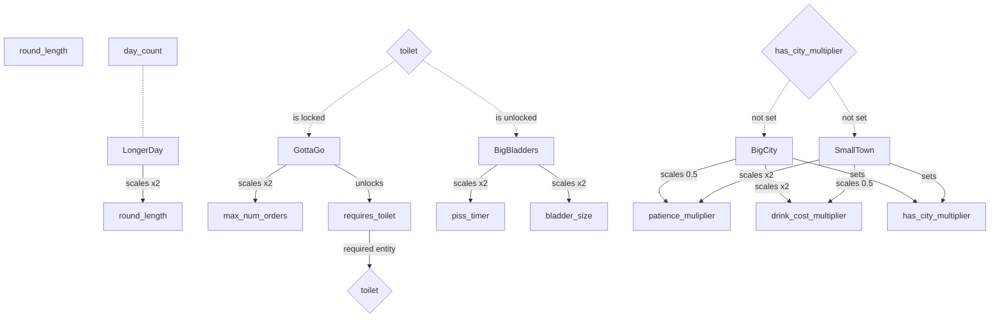

Edit on https://mermaid.live/ 

Some upgrade ideas: 
Live Music
- More customers + They reorder but band takes up space
Craft Beer 
- (lots of beer option + flights)
Crafting beer 
- (you make the alcohol :) )
Hidden Menu
Happy Hour
- more people in the middle of the day

Luxury Lavatories
oooooh shiny
(customers will order even more but need to wash their hands)

Bismuth Drink
some kinda pink liquid
(unlocks pepto which will reduce amount of vomit)

$10k beer
yea but this one has gold flake
(customers come less often but pay double)

Prohibition
peaky blinders
(people switch to non alcoholic drinks only)

Happy Birthday
shots for the lucky girl
(some customers will order more drinks at once)

Dynamic Prices
Supply and Demand, my man
(the longer the lines the more drinks will sell for)

Tablet Ordering
but now a robot does that
(customers will order and will pick it up later)

Mobile Ordering
Order for AJ Mobile
(customers can pre order)

PubMaps
finally a use for my smart phone 
(customers can use the bathroom without ordering)

Other types of cups
I can't see without my glasses
(adds another type of cup)

Bartending Robot
you put legs an on ipad?
(upgrade your tablet to help you make drinks)

Red Carpet 
woah who is that 
(adds a red carpet area that must have its own register, spawns a customer that always orders your most complicated drink) 

Entorage
me and the boys
(customers will come in groups but only one will order)

Pitcher
actually a carafe 
(adds a pitcher where you can add up to 10 of the same drink in)

Champagne
wheres the nearest sword?
(adds a sword which you need to open the champagne bottle)

Tea
oolong or ?
(adds tea pot as an option)

Coffee
oolong or ?
(adds coffee pot as an option)

Boba
_fake machine gun sounds_
(adds bubble tea as an option)

Three Scoops
actually gelato isnt from here
(customers can now order ice cream)

Ice Cream Float
root beer or diet coke
(adds the ability to add soda to ice cream)

Wine Tasting
remember to spit
(customers order more wine but spit more)

Juice Press
what do you mean it costs 3000$
(adds an automatic juicer)

Bottle or Tap? 
sparkling please
(adds water as an order, add sink) 

Going Green 
reduce reuse and recycle, cha
(customers will return their empty cups for reuse)

Head on a swivel
just shout your order
(customers will order any table connected to your register)

Speakeasy
'ere you go boss
(the more travel it takes customers to order the higher the tip)

Tourist
im visiting from michigan
(adds customers that will accept any drink)

Beer Wall
its all watered down any
(customers who want beer can reuse their cup and get their own drink)

Fast Food
just one for the road
(will order simple drinks and run)

Vegan
dragonfruit is so in
(some customers will order just fruit)

Mocktails
you dont think this is watered down?
(customers will order more drinks but you can replace one alcohol with soda without them noticing)

i know better
how can you not like the drink, you made it
(customers can order their own recipe)

fire code
its kinda hot in here 
(adds a max number of people allowed inside, the rest will hang outside)

Try this
you know maybe i will take the special
(place a drink in here and encourage people to order it)

frosty tips
brrrr
(customers can order their drink frozen)

Vacume Sealer 
wheres the straw
(you can save one drink between days)

SodaFountain
yall got free refills? 
(customers can serve themselves soda, sometimes multiple times)

Barcoded cups
no more mr nice guy
(no more refills but half profit from drinks)

Cash Only
you got change for a hunnit? 
(customers now pay in cash and you have to deposit)

five finger discount
dont mind if i do
(customers sometimes will steal bottles from behind the bar) 

metal detectors
**beep**
(customers who pass through and havent paid come back and pay)

bouncer 
party's full boys, take it home
(bouncer will turn away half the customers)

jukebox
gimme 14D
(adds jukebox that customers will pay to use)

bottle deposit
i hear they give double in california
(customers will return their cup with some money)

Me and Mrs Jones
you know i heard they have a thing going on 
(double customers but some will stop other customers from drinking more and take them home)

Year3000
wow these things have gotten so realistic
(upgraded special which remembers what drink was there)

Karaoke
A WHOLE NEW WORLD! A NEW FANTASTIC POINT OF VIEW
(adds karaoke machine, some customers will visit and order the drink as the person before them)

Trivia Night
cmon man when i wrote the sox i really meant the white sox
(customers will ask for the answers with their drink)

Pub Crawl
nah man this is our twelveth place today
(customers come more often in groups but order only beers)

Merch
'Best Mojito on this side of the Milky way'
(adds hats and shirts)

Limited Time Drop
the Existentialism series
(hats and shirts cost double but have a limited quantity)

Flavored Water 
hint of canteloupe
(adds flavored water) 

Sustainable
damn have you see their dumpster
(less customers but lose money for every ingredient used but not served)

Apple Cider
feels like fall
(cook apple juice to make apple cider)

