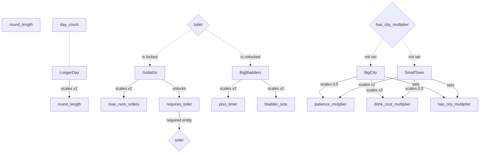

Edit on https://mermaid.live/ 

What happens when people drink way way too much 
bouncer

Some upgrade ideas: 

five finger discount
dont mind if i do
(customers sometimes will steal bottles from behind the bar) 
(whats the benefit)

metal detectors
**beep**
(customers who pass through and havent paid come back and pay)

Me and Mrs Jones
you know i heard they have a thing going on 
(double customers but some will stop other customers from drinking more and take them home)

Sustainable
damn have you see their dumpster
(less customers but lose money for every ingredient used but not served)
(maybe this is a themed one)

Pub Crawl
nah man this is our twelveth place today
(customers come more often in groups but order only beers)
(maybe too similar to ther things)

Multiple Floors
(club theme) 

General Upgrades 

Break the Seal 
(after the first piss, customer bladder size is halfed)
__enabled / disabled, need to track num pisses__
__requires bathroom upgrade__
// What is the value to the player for this?
// player can see how much piss the person has in them? 

Happy Hour
- more people in the middle of the day
- but less money during that time (like 3/4 price but double orders) 
__need some way of applying only during a certain time?__
__customer spawn multiplier 2x__
__drink cost multiplier 0.75__

Luxury Lavatories
oooooh shiny
(customers will order even more but need to wash their hands)
__requires toilet upgrade__
(should this be one of the theme upgrades?, requires a fancy theme to be enabled) 

$10k beer
yea but this one has gold flake
(customers come 3/4 less often but pay double)
__customer spawn 0.5__
__drink cost 2x__
(fancy theme)

Happy Birthday
shots for the lucky girl
(some customers will order more drinks at once)
__needs ability to order more than one drink at a time__
__needs way to serve multiple drinks at the same time?__

Dynamic Prices
Supply and Demand, my man
(the longer the lines the more drinks will sell for)
__enable dynamic pricing__
__need way to check how many people are behind you in line__

Tablet Ordering
but now a robot does that
(customers will order and will pick it up later)
(patience falls slower when not on line) 

Bartending Robot
you put legs an on ipad?
(upgrade your tablet to help you make drinks)

Mobile Ordering
Order for AJ Mobile
(customers can pre order)
(lose patience faster once inside bar, but none outside) 

PubMaps
finally a use for my smart phone 
(customers can use the bathroom without ordering alcohol)
__need way to influence customer orders somehow__

Other types of cups
I can't see without my glasses
(adds new types of cup)
(more tip if you match the cup with the drink) 
__need some way to track how close you are and tip accordingly__

Red Carpet 
woah who is that 
(adds a red carpet area that must have its own register, 
spawns a customer that always orders your most complicated drink) 
__needs to add some way of separating VIP from normal__
__add some way of placing a multiblock__
__visual difference? custom model for them? hat?__

Going Green 
reduce reuse and recycle, cha
(customers will return their empty cups for reuse)
(you get more profit, hard to understand for player thou)
bottle deposit
i hear they give double in maine 
(customers will return their cup with some money)
__where do they return it?__
__drink_cost_multiplier 1.1 or higher if drop anywhere__ 
__have to deal with the cup__

Head on a swivel
just shout your order
(customers will order any table connected to your register)
(maybe patience is slower when you are at the front of the line) 
__currently patience doesnt move at all when in line__ 

Speakeasy
'ere you go boss
(the more travel it takes customers to order the higher the tip)
(also harder to clean up the vomit)
__track time spent in each job? does it need to be that complicated__ 
__ decided to just go based on max pathfind length_

Tourist
im visiting from michigan
(adds customers that will accept any valid recipe)
(but they pay the cost for the drink)
__how to communicate that to the player__

Cash Only
you got change for a hunnit? 
(customers now pay in cash and you have to deposit)
__this should be pretty easy__

Regulars
the place where everyone knows your name
(remember who ordered what)
__less customers, more orders, more of the same order__
__force the player to remember somehow?__
__one customer for each drink you have in the recipe book__

**New Drink Options**

Pitcher
me and the boys, actually a carafe 
(customers will come in groups but only one will order)
(adds a pitcher where you can add up to 10 of the same drink in)
__need to be able to store how many of a drink is in a pitcher__

Craft Beer 
- (lots of beer option + flights)
__need more beer options__
__similar to pitcher but holds 4 unique liquids__

Crafting beer  / wine 
- ( you make the alcohol :) )
__how long does it take__ 
__patience doesnt currently take this into account__
__maybe we dont spawn customers for the first 1/4 of the day__ 

Bismuth Drink
some kinda pink liquid
(unlocks pepto which will reduce amount of vomit)
(does the customer request it?)

some kinda pink liquid
(unlocks pepto which will reduce amount of vomit)

Prohibition
peaky blinders
(people switch to non alcoholic drinks only)
__need a way to hide from the recipe section__

Champagne
wheres the nearest sword?
(adds a sword which you need to open the champagne bottle)
(quicktime event? fishing game, bigger tip for perfect)
__how do you hold a sword and bottle at the same time?__

Tea
oolong or ?
(adds tea pot as an option)
__fill pot with water__
__graduated progress bar__

Coffee
arabica or ?
(adds coffee pot as an option)
__fill pot with water__
__graduated progress bar__

Boba
_fake machine gun sounds_
(adds bubble tea as an option)

Three Scoops
actually gelato isnt from here
(customers can now order ice cream)

Ice Cream Float
root beer or diet coke
(adds the ability for customers to order soda float)

Wine Tasting
remember to spit
(customers order more wine but spit more)
(require unlocking wine, red or white)

Bottle or Tap? 
sparkling please
(adds water as an order, add sink) 
Flavored Water 
hint of canteloupe
(adds flavored water) 
Vegan
dragonfruit is so in
(some customers will order just fruit)

Mocktails
you dont think this is watered down?
(customers will order more drinks but you can replace one alcohol with soda without them noticing)

frosty tips
brrrr
(customers can order their drink frozen)
(blend the whole drink)

Trivia Night
cmon man when i wrote the sox i really meant the white sox
(customers will ask for the answers with their drink)

Merch
'Best Mojito on this side of the Milky way'
(adds hats and shirts)
(people will come back wearing it)
Limited Time Drop
the Existentialism series
(hats and shirts cost double but have a limited quantity)

Apple Cider
feels like fall
(cook apple juice to make apple cider)

**Furniture Upgrades** 

Juice Press
what do you mean it costs 3000$
(adds an automatic juicer)

Beer Wall
its all watered down any
(customers who want beer can reuse their cup and get their own drink)

SodaFountain
yall got free refills? 
(customers can serve themselves soda, sometimes multiple times)
(more customers stay longer but free)

Barcoded cups
no more mr nice guy
(no more refills but half profit from drinks)
(less customers but not free)

Try this
you know maybe i will take the special
(place a drink in here and encourage people to order it)

Year3000
wow these things have gotten so realistic
(upgraded special which remembers what drink was there)
(upgrade to the "try this")

Vacuum Sealer 
wheres the straw
(you can save one drink between days)

jukebox
gimme 14D
(adds jukebox that customers will pay to use)

Karaoke
A WHOLE NEW WORLD! A NEW FANTASTIC POINT OF VIEW
(adds karaoke machine, some customers will visit and order the drink as the person before them)

Automatic Drink Maker
(put a drink in as a recipe and then feed it with ingredients)
(can hold 3 of each ingredient)

**Per day upgrades**

Live Music
- More customers + They reorder but band takes up space
- buy it in the store 
- lasts only one day 
(add duration to json) 

Membership card 
...
(gives money up front and raises the minimum number of customers) 
(time limited?)

**Pub Themes**
(each of these come in a pair)

City size 
- big city / small city

Secret Menu
- customers can order custom drinks 
- (more complicated but less customers )
i know better
how can you not like the drink, you made it
(customers can order their own recipe)

Club theme 

fire code
its kinda hot in here 
(adds a max number of people allowed inside, the rest will hang outside)
(people waiting outside dont lose patience, or much slower)
(club theme upgrade) 

bouncer 
party's full boys, take it home
(bouncer will turn away half the customers)
(club theme)

